# Getting Started

## Objectives
* 개발환경을 설치하고
* InfineonRacer 코드를 다운 받아 빌드하고
* 각종 IO를 연결하여 동작 여부를 확인한다.

## References
* 개발환경 관련

## Example Description
1. 개발환경 구축
* 개발환경 구축을 위해 Tricore tool chain(compiler)와 UDE(Universal Debugger Engine)가 포함되어 있는 *HighTec*  설치
* 인피니언에서 제공하는 *BIFACES* build environment 설치
* Serial 통신 및 Shell 환경 구축을 위한 TeraTerm 설치
2. *BIFACES* 를 통하여 소스코드 빌드
3. 예제 동작 확인
    * *Application Kit TC2X7 V1.0* 보드(이하 *AppKit*)를 이용한 LED, Beeper, TFT 예제 동작
    * *DC Motor Control Kit* 보드(이하 *MotorKit*)를 이용한 Motor, Encoder, LineScanCamera 예제 동작

---
## 1. 개발환경 설치
### 1.1 HighTec Installation
* Dependency: [Java SE Development Kit](http://www.oracle.com/technetwork/java/javase/downloads/jdk8-downloads-2133151.html) **(32bit)**

1. [Tricore tool chain 홈페이지](http://free-entry-toolchain.hightec-rt.com/index.php)에서 개인 정보 입력 후 Generate License File & Download 버튼 클릭
    * 이때 입력한 개인정보는 HighTec 다운로드 완료 후 License 인증 시 필요

    

2. *free_tricore_entry_tool_chain.zip* 다운로드 후 압축 해제
3. 압축 해제된 파일 중 *setup.exe* 를 실행 후 설치 진행
    

   (HighTec 설치 진행 중 **UDEVisualPlatfrom** 과 **CDM Driver Package HighTec** 가 설치됨)
4. 설치 완료 후 **Eclipse.exe** *(C:\HIGHTEC\ide\eclipse-v1.6.1)* , **UDEVisualPlatfrom.exe** *(C:\Program Files (x86)\pls\UDE Starterkit 4.8)* 실행 확인

### 1.2 BIFACES Installation
* BIFACES [Download](추후입력)
1. 위 링크를 통해 다운 받은 압축파일 *(BIFACES_V1_0_0_Win32.zip)* 압축 해제

2. BIFACES_V1_0_0.exe 실행

3. 설치 진행

    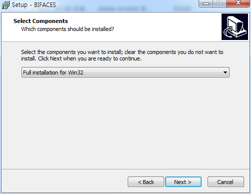

4. 설치 완료 후 **StartBifaces.bat** *(C:\Tools\BifacesTools)* 실행 확인

#### 1.3 TeraTerm Installation
1. [TeraTerm](https://ttssh2.osdn.jp/) 공식 홈페이지에 접속하여 다운로드 및 설치 진행
2. *Select Components* 에서 *Standard installation* 를 선택하여 설치 진행

    

3. 설치 완료 후 실행

        

---
## 2. InfineonRacer Project Build
### 2.1 Project download and import
1. [InfineonRacer](https://github.com/realsosy/InfineonRacer) 홈페이지 에서 **Clone or download** >> **Download ZIP** 클릭 후 *InfineonRacer-master.zip* downloasd 후 압축 해제

   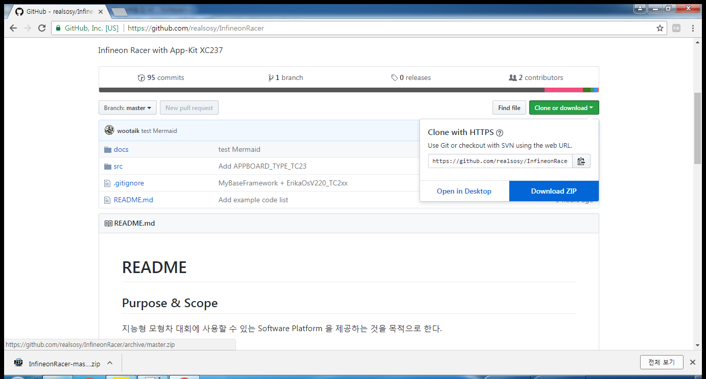

2. BIFACES 실행 (**StartBifaces.bat** *(C:\Tools\BifacesTools)* 실행)  

3. Workspace 설정
    * 소스코드를 포함한 프로젝트를 관리 할 폴더 설정

    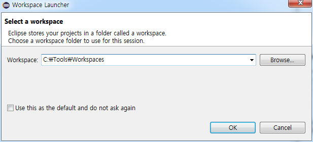

4. 다운로드 받은  InfineonRacer 프로젝트 Import
    * **File** >> **Import** 클릭

    

5. **General** >> **Existing Projects into Workspace** 선택 후 **Next >** 클릭

    

6. **Select root directory** 에서 **Browse...** 클릭, *1.* 에서 압축 해제한 폴더 선택 후 *src* 파일 *(~\InfineonRacer-master\src)* 선택하고 **확인** 클릭(이미지)

    

7. *Projects* 탭에서 **InfineonRacer_TC23A** 체크박스 선택, *Options* 탭에서 **Copy projects into workspace** 체크박스 선택 후 **Finish** 클릭(이미지)
    * 다른 프로젝트는 *InfineonRacer* 에서 다루는 각각의 [모듈기능](https://github.com/realsosy/InfineonRacer#dive-into-aurix-world-using-infineonracer) 으로 나누어져 있음

      

    * *Project Explorer* 를 통해 Import 된 프로젝트를 확인할 수 있음
    (Welcom 창은 닫으면 됨)

    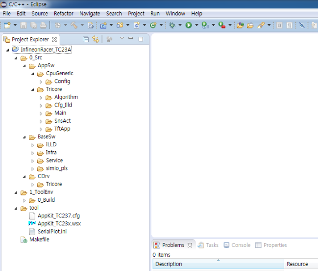

### 2.2 Build
0. Build 전 Complier 설정
    *Project explorer*  창에서 **InfineonRacer_TC23A** >> **1_ToolEnv** >> **0_Build** >> **1_Config** >> **Config_Tricore_Gnuc** 안에 있는 **Config_Gnuc.mk** 파일을 더블클릭 하면 Edit 창에서 편집 가능

1. *Project explorer* 를 통한 build
    1.1 *Project Explorer* 창에서 Build 할 프로젝트를 우클릭 한 뒤 **Build Project** 클릭

    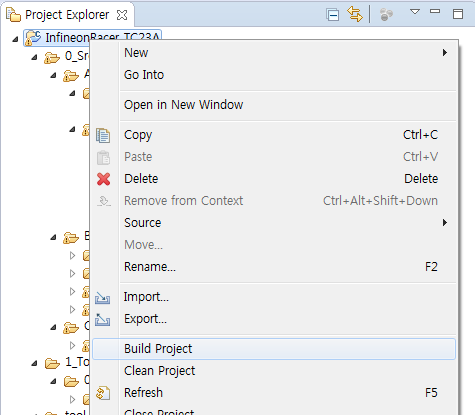

    1.2 Build 후 결과
         - *0_Build* 폴더에 *9_Make* 폴더 생성됨
         - *2_Out* 폴더 생성됨
         - *2_Out/Tricore_Gnuc/Gnuc_Files* 에 elf 파일과 hex파일 그리고 map파일 생성됨

    

2. *Make Target* 기능을 통한 build
    2.1 우측 *Make Target* 탭에서 *InfineonRacer_TC23A* 우클릭 한 뒤 **New...** 클릭

    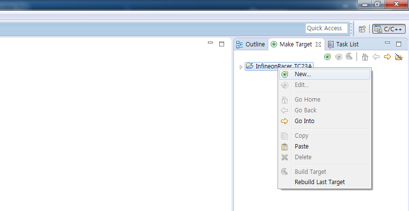

    2.2 *Target name* 에 *all* 을 입력하고 **OK** 를 클릭하면 프로젝트 하위에 *all* 파일 생성 확인

    
    (추가로 지원되는 build option은 *tool/Makefile* 에서 확인 가능)

    2.3 *all* 더블클릭 하여 build 수행 후 *1.2* 와 같이 파일들이 생성되었는지 확인

    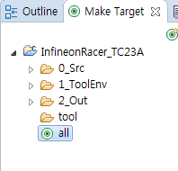

---
## 3. 프로그램 다운로드 및 예제 파일 실행
### 3.1 UDEVisualPlatfrom 실행 및 프로그램 다운로드하기
* Build를 통해 생성한 elf 파일을 *AppKit* 에 다운로드 하고 TeraTerm을 이용한 Shell 환경 실행

1. UDEVisualPlatfrom 을 실행하여 **File** >> **Open Workspace...** 클릭

    

2. *BIFACES Workspase/InfineonRacer_TC23A/tool/AppKit_TC23x.wsx* 파일 열기

    

3. Elf 파일 경로 확인 후 **OK** 클릭
(경로가 빌드 후 생성된 *2_Out/Tricore_Gnuc/Gnuc_Files/InfineonRacer_TC23A_tc.elf* 파일로 설정되어 있는지 확인)

    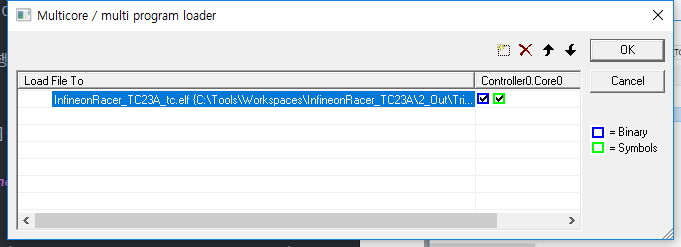

4. *AppKit* 를 USB로 Host PC와 연결한 후 **File** >> **Connect Target System..** 클릭
(Host PC와 첫 연결 시 드라이버 다운로드가 진행됨)

    

5. *UDE - FLASH/OTP Memory Programming Tool* 창에서 *Program all* 버튼 클릭

    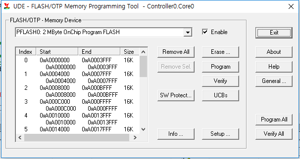

6. *Execute Memtool Command* 창에서 *Results: success* 와 같이 뜨면 *AppKit* 에 프로그래밍이 완료됨, **Exit** 를 클릭하여 *UDE - FLASH/OTP Memory Programming Tool* 창과 *Execute Memtool Command* 창을 닫음

    

7. **Debug** >> **Start Program Execution** 을 클릭하면 *AppKit* 에 다운로드 된 프로그램이 실행됨

    

    프로그램을 실행했을 때 *AppKit* 의 TFT 화면

    

8. **File** >> **Disconnect Target System..** 클릭하여 Host PC와 *AppKit* 와의 연결을 해제

    

9. *AppKit* COM port 활성화(첫 연결시 필요)
* 9.1 장치관리자 실행
* 9.2 **범용 직렬 버스 컨트롤러** >> **Infineon DAS JDS COM** 우클릭 한 뒤 **속성(R)** 클릭

    

* 9.3 *고급* 탭에서 **VCP 드라이버 설치** 체크 후 **확인** 클릭

    

* 9.4 *AppKit* 와 Host PC의 USB 연결을 분리했다가 재연결 한 뒤 *장치관리자* 에서 등록되는 COM port의 번호 확인

    

10. *TeraTerm* 실행 후 *Serial* 체크, *Port:* 에 *Infineon DAS COM (COMn)* 선택 후 **OK** 클릭

    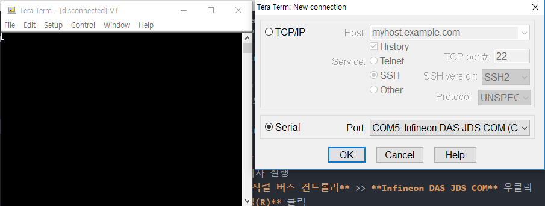

11. **Setup** >> **Serial port...** 클릭

    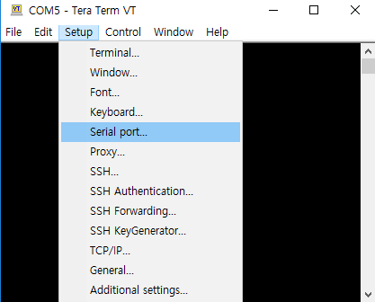

12. *Buad rate* 을 *115200* 으로 설정하고 *OK* 클릭

    

13. *TeraTerm VT* 창에서 enter 를 입력하면 *shell>* 이 화면에 나타남! 여기에 *Help* 를 입력하고 enter를 입력하면 아래의 사진과 같이 사용할 수 있는 명령어 셋과 설명이 나타남

    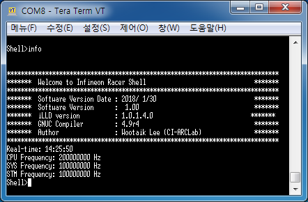

### 3.2 예제1
### 3.3 예제2
### 3.4 예제3

## 추가적인 설명

* !ToDo
    * 설치과정 이미지 포함 [O]
    * 라이센스 문제 해결법
    * BIFACES 다운로드 링크
