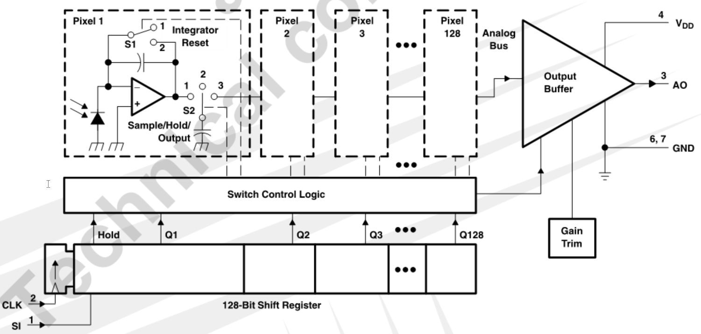
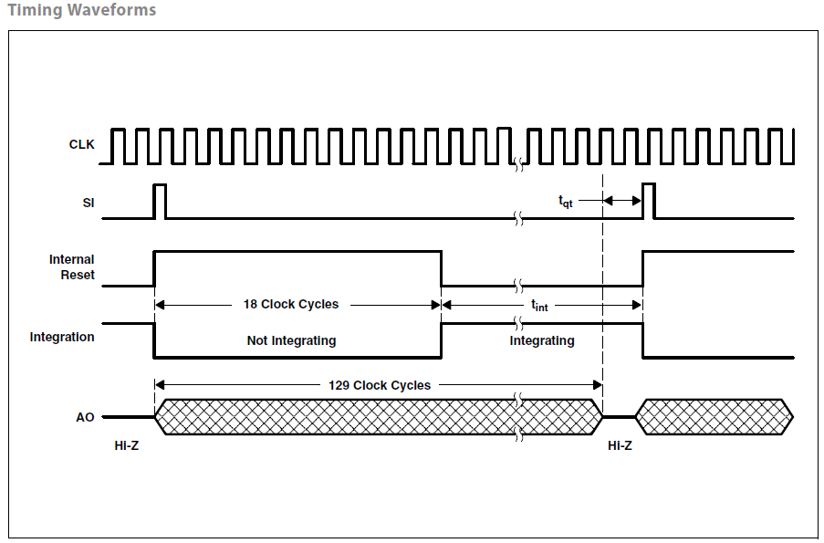
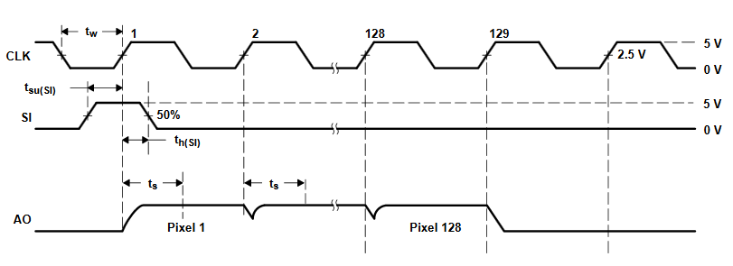
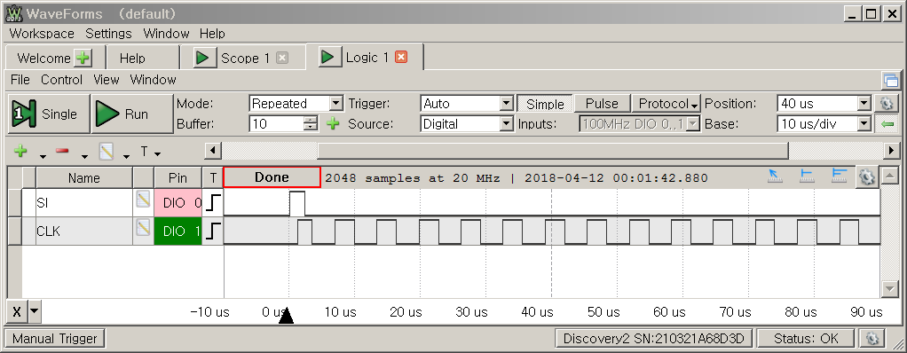

# Line Scan Camera (Optional)

**[알림]** 이 챕터는 TSL1401CL 이라는 Line Scan Camera를 저수준으로, 즉 하드웨어 신호를 고려하여 직접 프로그래밍 하는 방식으로, 인터페이스 하는 방법에 대하여 설명합니다.  만약 TSL1401CL을 사용할 것이 아니라면 굳이 이 챕터를 살펴보실 필요는 없습니다.

**[Pre-requisite]** [My own cheap oscilloscope](./MyOwnCheapOscilloscope.md)


## 시작하는 질문

* 카메라를 사용한다고? 그러면 영상 정보를 사용한다고? 마이크로컨트롤러에 카메라를 연결할 수 있는 것인가?  오잉? 이 카메라를 사용하려면 특정 펄스와 클럭 신호를 만들어 입력시켜야 한다네... 어떻게 해야 하나?


스마트 폰이 사용되면 반도체 센서들의 활용이 폭발적으로 늘어나게 되었습니다.  이전에 고가 장비 였던 GPS 센서, 지자계 센서, 가속도 센서, 근접 센서 등등, MEMS 기반의 센서들을 이제는 흔하게 사용할 수 있게 되었습니다.  지능형 자동차와 연관된 기술들이 개발 되면서 빛, 음파 등을 활용해서 거리, 색깔 등을 측정하는 센서들도 시작에 쏟아져 나오고 있습니다.  이미 상용화 되는 드론에는 이런 센서들이 목적과 용도에 맞게 수십개씩 탑재되고 있습니다.

지능형 모형차를 만드는데 꼭 필요하다 생각되는 센서 중에 TSL1401CL 기반의 Line Scan Camera 가 있습니다.  카메라가 맞습니다만, 단가와 마이크로컨트롤러와의 인터페이스를 고려하여 1차원, 직선만 읽어들이는 카메라 입니다.  지능형 모형차에 사용하기에 적당한 수준의 성능, 크기, 비용을 가지고 있습니다.  한가지 걸리는 것은 마이크로컨트롤러와의 인터페이스 부분입니다.  전용 프로토콜을 사용하고 있어서 이 센서를 사용하려면 저수준의 프로그래밍이 꼭 필요합니다.

그러나, 못할 것은 없습니다.  오히려 저수준 프로그래밍을 연습하는 기회로 삼아 봅시다.  마음의 준비 되셨습니까?  같이 한번 외쳐보고 시작해 봅시다. "도전!!!"


------


## Objectives

* TSL1401CL의 인터페이스 방식을 이해하고 
* 저수준 드라이버 프로그램을 설계하고 구현한다.

## References

* TSL1401CL Data sheet
* iLLD_TC23A Help / Modules/ VADC

**[Example Code]**

* InfineonRacer_TC23A - TestLineScan

------


## Example Description

* 디지탈 출력 신호를 발생하여 SI, CLK 신호를 발생시키고
* VADC AutoScan 기능을 사용하여 AO 신호를 변환한다.
* 좌측 전방과 우측 전방에 각각 Line Scan Camera 를 장착할 것을 고려하여 2채널의 아날로그 신호를 입력받을 수 있도록 한다.


## TS1401 정보

대부분의 MEMS 기반 센서들은 마이크로컨트롤러와 인터페이스 하는 것에 SPI, IIC 와 같은 직렬통신을 사용합니다만 TS1401은 마이크로컨트롤러에서 클럭 신호를 발생해 주면 이 클럭 신호와 동기화 되어서 센서 값을 아날로그 출력으로 내보내 주는 전용 프로토콜을 사용합니다. 해상도(Resolution)는 128 pixels 이며, Pixel 간 간격(space)은 8 um입니다.


**Functional Block Diagram**




$SI (Serial Port)$: Data output의 시작 시점을 정하게 됩니다.

$CLK (Clock)$: 센서가 동작할 수 있도록 Clock을 입력하게 되며, clock과 동기화 하여 charge transfer, pixel output, 그리고 reset을 제어하게 됩니다.

$AO (Analog Output)$: 센싱된 결과가 출력되는 포트 입니다.

$V_{DD}$: 입력 전압입니다.

$GND$: 접지를 나타냅니다.


Clock 주파수는 5kHz ~ 8000kHz의 범위를 가질 수 있고, SI 펄스가 입력되는 순간 부터 128 포인트의 측정결과를 AO 출력으로 내보낸다.




SI의 rising edge에서 이전 사이클에서 계측된 128 pixels 정보를 AO에 내보내게 됩니다. 동시에 18 clock cycles 동안 모든 pixel들의 integrators를 초기화 합니다. 19 clock cycles부터 모든 pixel 값을 integration 하게됩니다.

이전 사이클에서 계측된 값은 129 clock cycles이 되면 AO로 내보내는 것을 중단하게 됩니다. 현재 사이클의 계측된 값은 최소지연시간 $t_{qt}$ 이후 출력됩니다.



## iLLD - related

### Pin Configuration

```c
// in Configuration.h

#define TSL1401_SI					IfxPort_P14_6
#define TSL1401_CLK					IfxPort_P14_7
#define TSL1401_AO_1				9
#define TSL1401_AO_2				10
```


### Module Configuration

```c
void BasicLineScan_init(void)
{
	// Almost similar to VadcAutoScan except folling Pin configuration
    // AO_1, AO_2 pin으로 부터 Line scan 값을 받음
    // 이를 위한 adc channel configuration
        adcChannelConfig[chnIx].channelId      = (IfxVadc_ChannelId)(TSL1401_AO_1);
        adcChannelConfig[chnIx].resultRegister = (IfxVadc_ChannelResult)(TSL1401_AO_1);  

        adcChannelConfig[chnIx].channelId      = (IfxVadc_ChannelId)(TSL1401_AO_2);
        adcChannelConfig[chnIx].resultRegister = (IfxVadc_ChannelResult)(TSL1401_AO_2);  
    
    // for SI & CLK Signal **********************************************************
    // Line scan 값을 받기 위해서는 SI, CLK signal을 내보내야 함
    // 이를 위한 Port 초기 설정
    	IfxPort_setPinMode(TSL1401_SI.port, TSL1401_SI.pinIndex, IfxPort_Mode_outputPushPullGeneral);
		IfxPort_setPinPadDriver(TSL1401_SI.port, TSL1401_SI.pinIndex, IfxPort_PadDriver_cmosAutomotiveSpeed1);
		IfxPort_setPinState(TSL1401_SI.port, TSL1401_SI.pinIndex, IfxPort_State_low);

		IfxPort_setPinMode(TSL1401_CLK.port, TSL1401_CLK.pinIndex, IfxPort_Mode_outputPushPullGeneral);
		IfxPort_setPinPadDriver(TSL1401_CLK.port, TSL1401_CLK.pinIndex, IfxPort_PadDriver_cmosAutomotiveSpeed1);
		IfxPort_setPinState(TSL1401_CLK.port, TSL1401_CLK.pinIndex, IfxPort_State_low);

    }

```


### Module Behavior

```c
void BasicLineScan_run(void)
{
	uint32 chnIx;
	uint32 idx;
	
    // TSL1401 Operational waveform에 의거하여 SI, CLK의 signal을 내보냄
	IfxPort_setPinState(TSL1401_SI.port, TSL1401_SI.pinIndex, IfxPort_State_high);
	IfxPort_setPinState(TSL1401_CLK.port, TSL1401_CLK.pinIndex, IfxPort_State_low);
	waitTime(5*TimeConst_100ns);

	IfxPort_setPinState(TSL1401_SI.port, TSL1401_SI.pinIndex, IfxPort_State_high);
	IfxPort_setPinState(TSL1401_CLK.port, TSL1401_CLK.pinIndex, IfxPort_State_high);
	waitTime(5*TimeConst_100ns);

	IfxPort_setPinState(TSL1401_SI.port, TSL1401_SI.pinIndex, IfxPort_State_low);
	IfxPort_setPinState(TSL1401_CLK.port, TSL1401_CLK.pinIndex, IfxPort_State_high);
	waitTime(5*TimeConst_100ns);
    IfxVadc_Adc_startScan(&g_VadcAutoScan.adcGroup);


	for(idx = 0; idx < 128 ; ++idx)
	{
		// 200kHz로 Clk signal을 준다
		IfxPort_setPinState(TSL1401_SI.port, TSL1401_SI.pinIndex, IfxPort_State_low);
    	IfxPort_setPinState(TSL1401_CLK.port, TSL1401_CLK.pinIndex, IfxPort_State_low);
    	waitTime(3*TimeConst_1us);

    	IfxPort_setPinState(TSL1401_SI.port, TSL1401_SI.pinIndex, IfxPort_State_low);
    	IfxPort_setPinState(TSL1401_CLK.port, TSL1401_CLK.pinIndex, IfxPort_State_high);
    	waitTime(2*TimeConst_1us);

        /* check results */
        for (chnIx = 0; chnIx < 2; ++chnIx)
        {
            /* wait for valid result */
            Ifx_VADC_RES conversionResult;

            do
            {
                conversionResult = IfxVadc_Adc_getResult(&g_VadcAutoScan.adcChannel[chnIx]);
            } while (!conversionResult.B.VF);

            IR_LineScan.adcResult[chnIx][idx] = conversionResult.B.RESULT;
        }

	}

	IfxPort_setPinState(TSL1401_SI.port, TSL1401_SI.pinIndex, IfxPort_State_low);
	IfxPort_setPinState(TSL1401_CLK.port, TSL1401_CLK.pinIndex, IfxPort_State_low);
//	waitTime(1*TimeConst_10ms);

}
```




* Digital 출력 신호를 시간 지연을 사용해서 그린 것이다.
  * 타이머 2채널을 사용해서 두개를 동기화 하여 이와 같은 동작을 시킬 수도 있다.
  * 이해를 위하여 직접적으로 신호를 발생시키는 방식으로 데모를 구성하였다.
  * 명령어의 실행시간 등을 고려하여 약간의 실험적 튜닝도 필요하다.
* 전체 1싸이클, 128 point, ADC 변환을 위하여 약 850usec 의 시간이 필요하다.
  * 2채널을 병렬적으로 실행시켰으므로 850usec의 시간 (1msec 보다 짧은 시간)에 카메라의 정보를 모두 변환할 수 있다.

  


## 실험 결과

* 카메라 전면에 시험용 피사체로 좌측은 검은색, 우측은 흰색의 종이를 두고 실험한 결과


* 오실로스코프 측정 파형


* 디버거 실행으로 확인


* Shell 과 SerialPlot으로 모니터링 하는 화면


## 추가적인 설명

* 광학적인 특징

  * 라인스캔카메라는 광학 장치이고 전면부에 렌즈 장착
  * 렌즈의 초점 거리에 따라 측정되는 신호 특성의 차이가 크다.
  * 초점 거리를 실험적으로 튜닝해야 한다.

* 클럭 주기별 감광 특성 차이

  * 당연히 주변광에 따라서 측정 전압의 차이가 크다.

  * 같은 광학 조건이라도 라인스캔카메라에 공급되는 클락 신호의 주기에 따라 차이가 크다.

    * 주기가 크면 광량을 수집하는 시간이 길어지므로 어두운 곳에서도 측정 가능

    ​

------


## 마치며...

