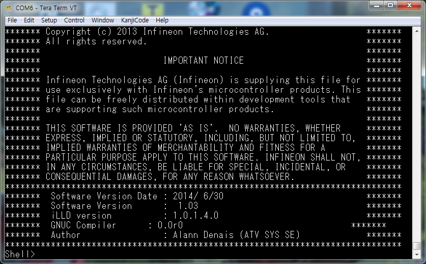
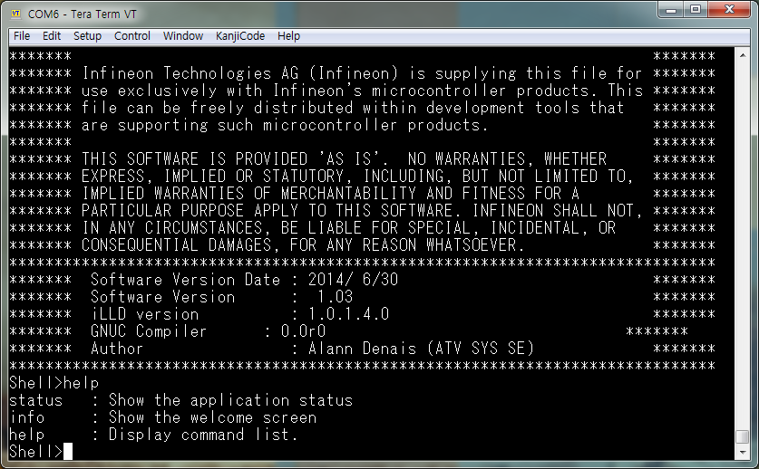

# My own terminal

## 시작하는 질문

* 터미날(Terminal), 쉘(Shell), 이런 것들이 뭐지?  이것이 왜 필요하지?


Window로 컴퓨터를 처음 접한 세대에게는 좀 낯설은 단어일 수 있습니다.  Window 로 대표되는 GUI 환경으로 컴퓨터를 사용하기 이전 시대에는 검은색 텍스트 창에 키보드로 타이핑을 하면서 컴퓨터를 사용했었습니다.  물론 그 시대에는 마우스도 없었습니다.  화려하지는 않지만, GUI 처럼 직관적이지는 않지만 지금 GUI로 하는 모든 조작을 다 했었습니다.  몇몇 작업들은 지금도 GUI 보다 텍스트 기반의 환경으로 하는 것이 훨씬 효율적입니다.  그중에 대표적인 것이 프로그래밍 입니다.  현재의 프로그래밍 작업환경은 예전의 텍스트 환경으로 했던 것들을 여러개의 윈도우를 사용해서 잘 정리해서 보여주는 것입니다.  내부적으로는 역시 텍스트 기반의 정보들이 움직이고 있습니다.  대표적으로 eclipse 의 console 창이 컴파일을 포함한 빌드 과정을 이러한 방식으로 보여주는 것입니다.

Window 의 cmd과 powershell, Linux의 sh, bash 같은 텍스트 기반의 사용환경을 쉘이라고 부릅니다.  이 쉘에서 제공하는 명령어들을 사용해서 컴퓨터를 조작할 수 있게 됩니다.  파일과 디렉토리 조작, 때로는 간단한 스크립트 언어를 제공해서 프로그래밍을 할 수도 있어서, 컴퓨터를 편하게 사용할 수 있는 기본 환경이 됩니다.  네트워크나 통신으로 원격으로 다른 컴퓨터의 쉘에 접속하여 조작하는 환경을 터미날이라 부릅니다.  Tera term, 혹은 putty 와 같은 터미날 프로그램이 많이 사용되고 있습니다.

컴퓨터의 쉘과 같은 환경이 임베디드 시스템에서도 꼭 필요할까요?  꼭 필요하지는 않습니다.  개발 단계에서는 터미날 보다 전용 디버거를 사용하는 것이 훨씬 효율적입니다.  그러나 시스템 시험단계, 혹은 유지보수를 하는 단계에서는 디버거를 연결하는 것이 어렵거나 불가능 할 수 있습니다.  이런 경우에는 통신을 통하여 기본적인 조작을 할 수 있는 쉘을 사용할 수 있도록 하는 것이 바람직 합니다.  결론적으로 쉘을 꼭 프로그래밍 할 필요는 없습니다.  그러나 몇몇 환경에서는 약간의 노력(?)을 들여서 쉘을 구성해 놓는 다면, 향후 시스템을 운영할 때, 유지보수 할 때 매우 유용하게 사용할 수 있습니다.

(참고) 일반적인 네트워크, 이더넷이나 USB, SCI 등, 를 사용하지 않는 자동차의 제어시스템에서는 CAN 네트워크를 통하여 접속할 수 있는 환경을 구성합니다.  자동차 업계에서는 이런 접속 환경을 용도에 맞게 더욱 세분화 하여서 전용 프로그램을 별도로 사용하기도 합니다.


## Objectives

* Shell의 유용성을 이해하고 구성하는 방법을 익힌다.


## References

* iLLD_TC23A_1_0_1_4_0 - Modules/Service software/System Engineering/Communication/Shell
* iLLD_TC23A_1_0_1_4_0 - Modules/Service software/Standard interface: Data Pipe
* [Hello World](./HelloWorld.md)

**[Example Code]**

* MyIlldModule_TC23A - AsclinShell
* InfineonRacer_TC23A - TestShellInterface


## Example Description

다음의 기능을 수행하는 쉘을 구성한다.

* Booting 시, 혹은 "info"  명령 입력시 초기화면(Welcome 화면)을 출력한다.
* "status" 명령 입력시 시스템의 정보를 출력한다.
* "help" 명령 입력시 도움말을 출력한다.


## Background 정보

* 하드웨어 추상화 계층 (Hardware Abstraction Layer)
  * 물리적인 하드웨어와 실행되는 소프트웨어 사이에 존재
  * 하드웨어의 차이를 숨겨서 응용 프로그램이 작동할 수 있는 일관된 플랫폼을 제공

- Shell의 계층적 구조
  * Standard interface > Data Pipe를 통해 통신 계층을 한번 더 추상화
  * 통신 종류에 구애받지 않고 일관된 인터페이스를 사용


* Standard interface
  * 추상화를 통해 프로그램 구성을 도와주는 iLLD 내부 인터페이스 모듈


## AURIX - related

* 이번 예제에서 쉘은 아래 계층으로 Asc 모듈을 사용합니다.

## iLLD - related

### Module Configuration

* Asc 통신 관련 초기화 생략

- 추상화 계층을 통해 시리얼 통신과 shell을 연결

```c
// in AsclinShellInterface.c
void initSerialInterface(void)
{
    {
        IfxAsclin_Asc_Config config;
        IfxAsclin_Asc_initModuleConfig(&config, &MODULE_ASCLIN0);

	// 중간 생략     

        IfxAsclin_Asc_initModule(&g_AsclinShellInterface.drivers.asc, &config);

        // 초기화한 asc 설정을 data pipe와 connect
        IfxAsclin_Asc_stdIfDPipeInit(&g_AsclinShellInterface.stdIf.asc, &g_AsclinShellInterface.drivers.asc);
    }

	// 중간 생략    

}
```

* Shell interface 초기화

```c
// in AsclinShellInterface.c
void AsclinShellInterface_init(void)
{

	//중간 생략

    {
        Ifx_Shell_Config config;
        Ifx_Shell_initConfig(&config);

        // 어떤 통신으로 데이터를 주고 받을 것인가
        config.standardIo     = &g_AsclinShellInterface.stdIf.asc;

        // 어떤 command를 사용할 것인가
        config.commandList[0] = &AppShell_commands[0];

        Ifx_Shell_init(&g_AsclinShellInterface.shell, &config);
    }
}
```

* Command
  * Callback 함수로 구현되며,
  * {이름(call), 도움말, &data, &handler} 의 형태로 정의,
  * Shell을 통해 들어온 data가 call을 만족할 때 handler함수를 실행하는 구조.

```c
// in AsclinShellInterface.c
const Ifx_Shell_Command AppShell_commands[] = {
    {"status", "   : Show the application status", &g_AsclinShellInterface,       &AppShell_status,    },
    {"info",   "     : Show the welcome screen",   &g_AsclinShellInterface,       &AppShell_info,      },
    {"help",   SHELL_HELP_DESCRIPTION_TEXT,        &g_AsclinShellInterface.shell, &Ifx_Shell_showHelp, },
    IFX_SHELL_COMMAND_LIST_END
};
```

### Interrupt Configuration

* 인터럽트가 일어나면 data pipe 모듈을 통해 처리

```c
// in AsclinShellInterface.c
IFX_INTERRUPT(ISR_Asc_0_rx, 0, ISR_PRIORITY_ASC_0_RX);

void ISR_Asc_0_rx(void)
{
    IfxCpu_enableInterrupts();
    IfxStdIf_DPipe_onReceive(&g_AsclinShellInterface.stdIf.asc);
}

// rx 인터럽트와 유사
IFX_INTERRUPT(ISR_Asc_0_tx, 0, ISR_PRIORITY_ASC_0_TX);
IFX_INTERRUPT(ISR_Asc_0_ex, 0, ISR_PRIORITY_ASC_0_EX);
```


### Shell 동작

```c
// in AsclinShellInterface.c
void AsclinShellInterface_run(void)
{
    Ifx_Shell_process(&g_AsclinShellInterface.shell);
}
```
* Terminal에 연결 후 실행하거나 info 명령어를 넣었을 때 나오는 화면



* "help" command를 입력하면 설정된 함수에 의해 다음과 같이 표시된다.




**[주의]**

* 이러한 서비스는 본래의 제어를 방해해선 안되며,
* Schedule의 비는 시간에 동작해야 한다.
* 각각의 command 역시 같은 맥락에서 최대한 짧고 간결하게, 꼭 필요한 동작만.


## 추가적인 설명

### In InfineonRacer

* STM을 바탕으로 스케줄러를 구성하고 idle 시간에 shell interface를 동작

```c
//in BasicStm.c
void BasicStm_run(void)
{

	if(task_flag_1m == TRUE){
		appTaskfu_1ms();
		task_flag_1m = FALSE;
	}

	if(task_flag_10m == TRUE){
		appTaskfu_10ms();
		task_flag_10m = FALSE;
	}

	if(task_flag_100m == TRUE){
		appTaskfu_100ms();
		task_flag_100m = FALSE;
	}

	if(task_flag_1000m == TRUE){
		appTaskfu_1000ms();
		task_flag_1000m = FALSE;
	}

	appTaskfu_idle();

}

//in AppTaskFu.c
void appTaskfu_idle(void){

    AsclinShellInterface_run();

}
```

* 연결된 차량의 state를 관측할 수 있도록 shell command를 구성

```c
//in AsclinShellInterface.c
const Ifx_Shell_Command AppShell_commands[] = {
	// 중간 생략

    {"srv", "      : Servo Angle", &g_AsclinShellInterface, &AppShell_srv,    },

	// 중간 생략
};

boolean AppShell_srv(pchar args, void *data, IfxStdIf_DPipe *io)
{
	float32 vol;
	if (Ifx_Shell_matchToken(&args, "?") != FALSE)
    {
        IfxStdIf_DPipe_print(io, "  Syntax     : srv frac-value"ENDL);
    }
    else
    {
    	if(Ifx_Shell_parseFloat32(&args, &vol) == TRUE){
    		IR_setSrvAngle(vol);
    	}
    	IfxStdIf_DPipe_print(io, "  SrvAngle: %4.2f fraction"ENDL, IR_getSrvAngle());
    }

    return TRUE;

}

```
* 그렇다면 차량의 analog 데이터는 어떤 식으로 board 안으로 들어오는 것이지?

- 답은 앞으로 진행할 예제들을 통해 얻을 수 있다.

## 마치며...

목표 지점에 빨리 도달해야 겠다는 욕심으로 최종 결과물에만 집중하게 됩니다.  작은 일이면, 그리고 그 일을 한번만 할 것이라면, 좌우를 살피지 않고 앞만 보고 달려가는 것이 최선입니다.  그러나, 작지 않은 일이어서 중간에 몇번 쉬어야 하는 일이라면, 그리고 그 일을 계속 반복적으로 할 것이라면, 달려가기 전에 한번 생각해 보아야 합니다.  '일을 어떻게 나누어야지?', '이 일을 좀 더 효율적으로 할 수 있는 방법은 없을까?' 등등의 고민을 해야 합니다.  반복적으로 해야 하는 일이라면 효율적인 환경과 도구를 만들어 두는 것이 결과적으로는 더욱 빨리 최종 결과물을 만들 수 있는 방법입니다.  

'Shell' 이 바로 그런 도구 입니다.  최종 결과물의 핵심 기능은 아니지만, 좋은 결과물을 만들어 낼 때 활용할 수 있는 좋은 도구가 됩니다.  이 프로젝트에서도 'Shell'을 적극적으로 사용할 것입니다.  귀찮지만, 그 수고러움은 편의성으로 충분히 보상됩니다.
