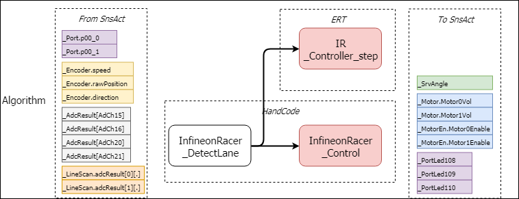
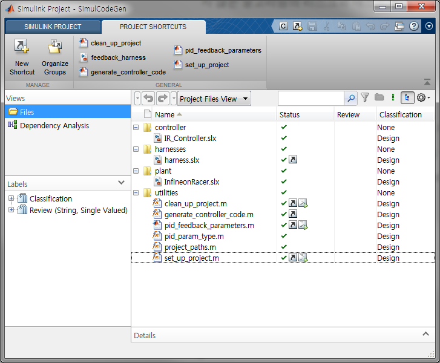
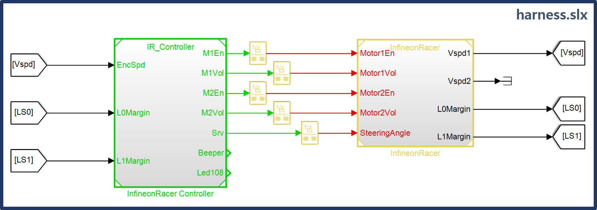
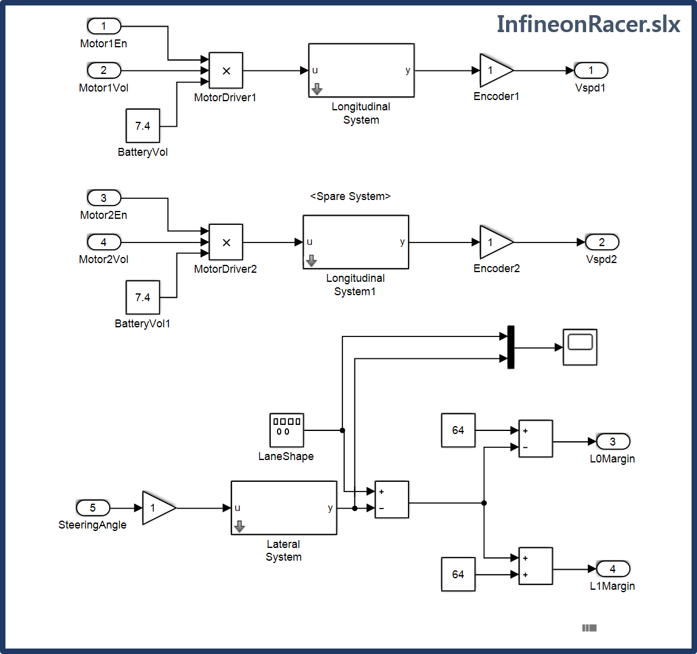

# Simulink as a programming language

## 시작하는 질문

* 제어 공학에서 시뮬레이션을 하고 분석하는 것을 열심히 배웠는데.... 이 때 만든 알고리즘을 인피니언 레이서에도 활용하려면 어떻게 해야 할까?  

학교에서 **마이크로컨트롤러 수업을 들으면 하드웨어적인 입출력에 대한 처리**에 대해서 주로 배우게 됩니다.  그리고 제어공학에서는 전달함수, 상태방정식 등 이론적인 내용을 바탕으로 **제어알고리즘을 해석적으로, 시뮬레이션을 활용해서 설계하는 방법**을 배우게 됩니다.  실제 제어시스템을 만들려면, 아니 지금 여러분이 만들고 있는 인피니언레이서에도 이 지식이 모두 결합되어야 합니다.  이때 위와 같은 질문을 하게 됩니다.  

많은 엔지니어들이 노력해서 이 두가지, 즉 제어공학과 마이크로컨트롤러 프로그래밍, 분야의 작업을 효율적으로 연결하는 방법을 만들어 냈습니다.  모델을 사용하여서 제어기의 구조와 이득값 등을 시뮬레이션 단계에서 설계하고, **자동코드 생성도구**를 활용하여서 마이크로컨트롤러에서 사용할 수 있는 C 소스코드를 만들어 냅니다.  전체 소프트웨어에서 이 부분은 주로 알고리즘영역에 해당합니다.  이 알고리즘을 입출력을 담당하는 다른 부분과 연결하여서 전체 소프트웨어를 만들어 낼 수 있습니다.  이와 같은 개발 방법을 **모델기반의 개발 방법(MBDP:Model-Based Development Process)** 라고 부르고 있습니다.  복잡한 제어 알고리즘을 개발하는 경우에는 매우 효율적인 개발 방법 입니다. 이 방법으로 알고리즘을 개발하게 된다면, **시뮬링크가 프로그래밍 언어**처럼 역할하게 됩니다.  시뮬링크로 만든 모델이 C 소스코드가 되는 것이고, 자동코드 생성 툴 박스가 컴파일러 처럼 역할을 하게 됩니다.  


## Objectives

* 모델기반 개발방법론을 이해하고 
* 필요한 부분에 적용하여 활용할 수 있도록 한다.


## References
* https://kr.mathworks.com/products/simulink-coder.html

[Example Model]

* InfineonRacer/src/matlab

## Example Description

* 인피니언레이서의 종방향, 횡방향 제어기를 모델기반 제어기 설계 방법으로 만들어 본다.

    * Simulink를 사용하여 모형차를 모델링하고
    * 제어알고리즘을 설계해보고, 성능을 튜닝하고,
    * 자동코드생성을 이용하여 프로젝트에 통합하여 검증


**[참고]**

* InfineonRacerUserGuide의 내용 처럼 알고리즘에 해당하는 부분은 HandCode로 프로그래밍을 할 수도 있고 ERT를 사용하여 자동코드로 개발할 수도 있습니다.  
* ``InfineonRacer_DetectLane()`` 부분은 각종 규칙들이나 필터등을 사용하는 수동코드 개발 방법으로 만드는 것을 전제로 합니다.
    * 이 함수는 차량 좌우측 전방에 라인스캔 카메라가 부착되어 있어서 이것으로 경계선을 읽고
    * 차량의 진행방향으로 부터 얼마만큼의 마진을 가지고 있는지 제어 알고리즘에 알려주는 것으로 가정하였습니다.
    * 배포되는 코드에서는 함수의 구조만 구성되어 있습니다.
* 차량의 종방향, 횡방향 제어에 해당하는 부분만 선택할 수 있도록 예제를 구성하였습니다.
    * 모든 코드를 수동으로 개발하고자 한다면 ``InfineonRacer_Control()`` 함수에 프로그래밍하고
    * 이 예제에서와 같이 자동 코드 생성 기법을 사용하고자 한다면 ``IR_Controller_xxx()`` 함수를 만드는 것입니다.




### Background 지식

* 모델기반 개발방법 (Model-Based Development Process) 이란?

모델기반 개발방법이란 "시뮬레이션 단계에서 사용한 모델을 최종 제어시스템에서 사용할 수 있도록" 하는 개발 방법이다.  시뮬레이션 단계에서 C 코드를 사용하였다면 좀 더 쉽게 제어시스템에 활용할 수 있도록 만들 수 있지만, 현재 많은 경우에 C 코드 보다는 그래픽 기반의 제어기 모델을 사용하고 있다.  그러므로 그래픽 기반의 모델을 C 코드로 변환하는 자동코드생성 도구를 사용하여야 한다.   

* 모델기반 개발방법의 장점

가장 큰 장점은 소프트웨어 개발을 전문적으로 훈련받지 않은 제어 엔지니어가 표현한 알고리즘을 최종 시스템에 그대로 활용할 수 있다는 것이다.  제어 엔지니어가 표현한 알고리즘을 소프트웨어 엔지니어가 다시 프로그래밍 해야 한다면, 이 과정에서 의사 전달의 오류가 발생할 수 있게 된다.  두번째로 꼽을 수 있는 장점은 알고리즘의 구조 파악을 용이하게 해준다는 것이다.  소스코드로 표현된 알고리즘은 이것을 이해하기 위해서 별도의 문서, 혹은 그림 등을 필요로 하게된다.  그러나 그래픽한 모델로 표현된 알고리즘은 그 자체가 알고리즘의 구조적인 표현이기 때문에 별도의 그림 없이 내용을 전달할 수 있다.  아울러 시뮬레이션이 최종 시험을 대신할 수 있도록 구성할 수 있어서 최종 시험이 어려운 경우에 매우 유용하게 사용할 수 있다.


Mathworks 사에서는 이와 같은 개발 방법을 도와주기 위하여 일련의 개발 도구를 제공하고 있다.

* Simulink: 그래픽한 모델 개발 환경
* ERT(Embedded Real-time Target): 자동코드 생성 도구

이 장에서는 Simulink를 사용해서 인피니언레이서의 차량 종방향 속도 제어와 횡방향 서보모터 제어 알고리즘을 모델기반 개발방법론에 따라 개발해 본다.


### 개발과정 요약

* Simulink project 구성
    * 차량 모델과 제어기 모델을 따로 구성하고
    * Harness 를 사용하여 연결하여 시뮬레이션 할 수 있도록 구성
* Control algorithm을 설계하고 plant model을 이용하여 튜닝
    * 제어기 모델 부분에 알고리즘을 구체적으로 설계하여 모델링하고
    * 차량 모델과 함께 시뮬레이션 하여 정성적, 정량적 분석을 합니다.
    * 이 단계에서 제어기 모델의 파라메터까지 튜닝할 수도 있습니다.
* Code generation으로 control algorithm의 c-code 생성
    * 제어기 모델은 전체 소프트웨어의 일부분입니다.
    * 제어기 모델의 입출력과 이미 구성되어 있는 다른 부분과 연결시켜 주어야 합니다.
    * 이 입출력에 대한 구체적인 속성들을 코드생성 전에 반영해 주어야 합니다.
* 생성된 알고리즘 프로젝트에 통합
    * 자동생성된 코드를 스케쥴러와 연결시켜 통합하여야 합니다.

      
### 프로젝트 구성

* **MATLAB 2016b**이상의 버젼에서 matlab 폴더의 SimulCodeGen.prj를 실행시킨다.
* MATLAB project는 다음과 같이 이루어져 있다.
  


* utilities - Project의 각 기능들을 구성하고 있는 script들
    * clean_up_project: Project를 clear
    * set_up_project: Project를 시작할때 동작시키며, project_paths, pid_param_type등 프로젝트 동작에 관련된 script들을 실행시켜 프로젝트를 동작시킬 준비를 완료함

* harness.slx - control algorithm과 plant를 연결시켜 주는 모델
    * ```controller.slx```와 ```plant.slx```가 model reference 형태로 동작
    * Control algorithm to plant model
        * Motor enable
        * Motor voltage
        * Steering angle
    * Plant model to control algorithm
        * Vehicle speed
        * Lane Margin 0, 1
    * Control algorithm과 plant model이 다른 주기로 simulation 되기 때문에 사이에 rate transition block이 동작
        * Control algorithm period: 20 ms
        * Plant model: 1 ms
        * Plant model은 simulation 주기가 짧을 수록 정확하기 때문에, control algorithm은 실제 임베디드시스템에서 동작하기 때문에 가능한 실행 주기를 맞춰 줘야하기 때문에 다른 실행주기를 갖음
        * 각 알고리즘의 실행주기는 Workspace에 T_IR_Control=0.02, T_IR_Plant=0.001로 선언되어있다

       


* controller - 차량의 속도 및 핸들링을 제어하는 제어 알고리즘
    * 2개의 PID 제어 알고리즘 (종방향/횡방향)
    * Motor drive enable 기능
    * 알고리즘 동작여부 확인을 위한 beep on, LED 기능으로 구성
    


* plant - 차량의 모델
    * 종방향 모델과 횡방향 모델로 구성
    


### Controller design

* Controller는 차량의 종방향 속도를 제어하는 PID 제어기와
* Lane을 따라 횡방향 스티어링을 제어하는 PID 제어기로 이루어져 있다.
* 각 제어 알고리즘은 P, I, D gain 값을 변경하여 알고리즘의 성능을 조절한다
    * 제어기의 gain들은 **Workspace**에 변수로 선언되어 있다.
    * LatPid = Lateral control gains
    * LongiPid = Longitudinal control gains
    * MATLAB command를 이용하여 다음과 같이 값을 변경 할 수 있다.
    * ex) LatPid의 P gain: 0.7, I gain: 7
```
>> LatPid.Value.P = 0.7
```
* 제어 결과는 plant model에서 확인 가능하다.
    * 제어 알고리즘의 gain 값들을 변경한 후 harness model을 동작시킨다
    * 각 system의 output 값을 확인하여 제어알고리즘의 성능을 확인한다
    * 아래그림은 횡방향 제어의 PID gain 값 변화에 따른 제어 결과이다
    

### Code generation
* Algorithm 설계가 완료되었다면 이를 code generation을 통하여 c-code로 생성하자
* Code generation은 utilities의 ```generation_controller_code```를 실행시키면 된다.
    * 생성된 code를 기존 project에 통합하기 위해서 code가 생성될 경로를 지정해 주어야 한다
    * generation_controller_code내의 code를 수정하여 진행한다

```
%in generation_controller_code.m
function generate_controller_code()
  % ----- 내용 생략
  controllerModel = 'IR_Controller';
  
  if(~bdIsLoaded(controllerModel))
      open_system(controllerModel);
  end
  
  slbuild(controllerModel);
  % coder.report.generate(controllerModel);
  
  !cp ./work/IR_Controller_ert_rtw/IR_Controller.c ../InfineonRacer_TC23A/0_Src/AppSw/Tricore/Algorithm/ert
  % (생성된 코드가 저장될 project path)
  
  % ------ 이하 생략
```  

* controller의 input과 output을 실제 project내의 signal과 matching을 시켜줘야 한다.
    * controller는 *input*으로 **vehicle speed**를 받아서 제어결과 **motor voltage**를 *output*으로 내보낸다
    * 이때 **vehicle speed**와 **motor voltage**등의 signal들은 이미 위의 실습들을 통하여 basic software나 다른 iLLD driver, 혹은 hand coding 된 interface를 통해서 읽거나 쓸 수 있다.
    * 예를들어 vehicle 속도는 encode speed를 측정하여 받을 수 있다
    * Controller 내에 EncSpd는 EncSpeed signal로 정의되어 있고,
    * 이를 model explorer에서 열어보면 아래 그림과 같이 EncSpeed의 code generation 항에서 값을 받고 쓰는 interface 함수를 연결해 줄 수 있다.
    * EncSpeed를 받는 interface 함수는 project의 Basic.h 파일내에 IR_getEncSpeed()로 정의되어 있다
```c
    /******************************************************************************/
    /*-----------------------------------Macros-----------------------------------*/
    /******************************************************************************/
    #define IR_getEncSpeed() IR_Encoder.speed
    #define IR_getEncPosition() IR_Encoder.rawPosition
    #define IR_getEncDirection() IR_Encoder.direction
```


### Integration to algorithm
* Code 생성이 완료되면 프로젝트의 설정한 경로(*Algorithm/ert*)에 파일들이 생성되며,
* 이중 ```IR_Controller.h``` 에 정의되는 함수들을 스케쥴러인 ```AppTask.c```에서 task period에 맞게 동작시킨다
```c
  // 초기화시 실행시키는 function //
  extern void IR_Controller_initialize(void);
  
  // 매 주기마다 동작하는 function으로 simulink에서 design한 control algorithm이 수행 //
  extern void IR_Controller_step(void);
  
  // 모든 프로그램이 종료될때 실행이 필요한 function이나 일반적으로 사용하지 않는 경우가 많음 //
  extern void IR_Controller_terminate(void);
```
* 초기화를 위한 ```IR_Controller_initialize(void)```는 initial task에
```c
  //in AppTask.c
  void appTaskfu_init(void){
  // 이상 생략
  #ifdef CODE_ERT
    /-------------------------/
    IR_Controller_initialize();
    /-------------------------/
  #else
    InfineonRacer_init();
  #endif
  }
```
* 제어를 위해 ```IR_Controller_Step(void)```는 20 ms task에서 실행된다
```c
  //in AppTask.c
  void appTaskfu_10ms(void)
  {
  // 이상 생략 //
  
  // 20ms task //
  if(task_cnt_10m%2 == 0){
  
  	if(IR_Ctrl.basicTest == FALSE){
  		#ifdef CODE_ERT
          	/---------------------/
  			IR_Controller_step();
              /---------------------/
  		#else
  			InfineonRacer_control();
  		#endif
  	}
  	AsclinShellInterface_runLineScan();
  }
```
* 마지막으로 code를 build할때 control algorithm을 simulink에서 생성된 제어 알고리즘을 사용할지,

* 혹은 hand coding으로 설계한 제어 알고리즘을 사용할지 결정해준다.
    * ```Configuration.h```에서 CODE_ERT를 define
```c
    //in Cfg_Illd/Configuration.h
    // 이상 생략 //
    /* 다음 3개중의 하나만 정의해서 사용*/
    //#define CODE_HAND			// Hand code : default
    #define CODE_ERT		    // Using embedded coder
    //#define CODE_SCILAB		// Using SciLab (추후 update 예정)
```


## 추가적인 설명

* Algorithm 동작여부 확인
    * Algorithm이 잘 integration 되어서 build가 되었는지 실제 차량을 제어해보기 전에 간단히 beep와 LED를 통하여 확인해 볼 수 있다.
    * 아래 그림과 같이 BeepOn signal 값을 1(on)로 하거나 Led108의 on/off 주기를 변경하여 보면 된다

  

## 마치며

모델기반 개발방법과 자동코드 생성 도구가 세상에 소개되었을 때 이것이 소프트웨어 개발에서 발생되는 모든 어려움을 극복할 수 있는 강력한 방법이 될 것이라는 긍정적인 기대가 팽배했었습니다.  그러나 세상의 모든 것들이 그러하듯이, 이 방법이 유용하게 적용되는 경우가 있고, 전통적인 프로그래밍 방법이 효과적인 경우가 있습니다.  대표적인 예로 비트단위 조작을 하는 경우를 생각해 보면, C 언어를 사용해서 1~2 줄에 코딩하면 되는 것이 그래픽한 언어로 표현하면 한페이지를 다 차지하는 복잡한 그림을 그려야 합니다.  반대의 경우로 상태머신을 프로그래밍하는 경우, 정적 변수와 스위치 케이스문으로 복잡하게 프로그래밍 하여야 하는 것을, 그래픽한 언어로는 상태도로 간단하고 정확하게 표현할 수 있습니다.  자동코드 생성기법을 사용하는 것과 전통적인 프로그래밍 방법은 상호 배타적으로 사용해야 하는 것이 아니라, **용도에 따라 상보적으로 선택하여 사용**하는 것이 바람직 합니다.


