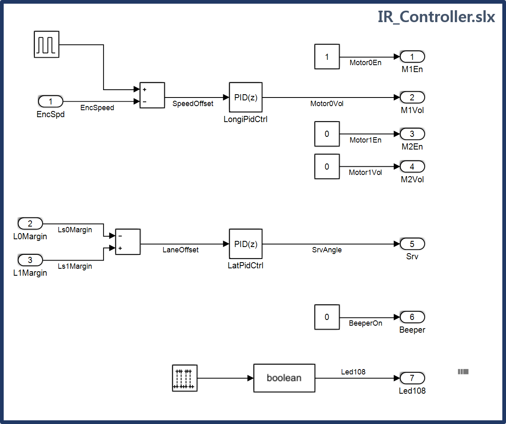
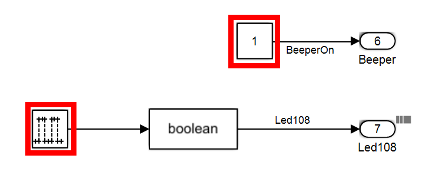

# Simulink as a programming language

## Model based SW design

지금까지 배웠던 내용들을 이용해서 결국은 레이싱을 위한 **SW를 설계**해야 할텐데....

이 장에서는 이에 대한 완벽한 답은 될 수 없지만 하나의 방법으로 모델기반 소프트웨어 디자인 방법을 설명한다. 여기서 모델기반이란 **SW를 설계할때 그래픽기반의 모델을 이용**하는 것으로 대표적으로 사용되는 그래픽기반 모델은 MATLAB Simulink이다. 모델기반 소프트웨어 디자인의 장점은 다음과 같다.

1. 가독성이 향상되며 유지보수가 용이하며 자동코드 생성을 통하여 코드의 퀄리티를 보증
2. SW를 직접구현하기 전 시뮬레이션을 통하여 성능 검증이 가능

결국은 위와 같은 장점들 때문에 SW를 개발하는 시간이 획기적으로 줄어들 수 있으며 최근 소프트웨어 개발에 많이 사용되고 있는 추세이다. 결국 자동코드 생성을 제공하는 그래픽기반의 모델역시 하나의 프로그램언어가 될 수 있다. 이번장에서는 레이싱을 위한 가장 핵심적인 제어알고리즘인 차량의 종방향 속도와 라인을 따라가도록 하는 횡방향 서보모터 제어알고리즘을 Simulink를 이용하여 설계해 본다.

## Objectives

* Simulink를 이용하여 제어알고리즘을 설계해보고,
* 제어대상인 모형차를 모델링하여 제어알고리즘의 성능을 튜닝하고,
* 자동코드생성을 이용하여 프로젝트에 통합하여 검증하는 일련의 과정을 실습한다.

## References
* https://kr.mathworks.com/products/simulink-coder.html

[Example Model]

* InfineonRacer/src/matlab

## Example Description 

####  MATLAB Simulink

* Simulink란 무엇인가
  * ODE를 기반으로 알고리즘을 수학적으로 해석하는 프로그램으로,
  * 알고리즘은 아이콘화된 여러 그래픽 라이브러리를 통해 설계된다.
* 시스템 모델링 및 시뮬레이션
  * 모델을 통하여 제어를하고자하는 대상, 물리적 플랜트의 동적 특성을 시뮬레이션 할 수 있다.
  * 인피니온레이스: 우리가 제어하고자하는 차량을 모델링하여 모터의 입력과 서보모터를 통한 스티어링으로 차량의 동작을 시뮬레이션 할 수 있다.
* 시뮬레이션을 통한 잦은 테스트
  * 실제 알고리즘의 초창기 설계나 성능을 튜닝할때 시뮬레이션을 통해서 시스템을 테스트 함으로서 검증되지 않은 알고리즘의 리스크와 테스트에 소모되는 비용/시간을 최소화 할 수 있다.
  * 인피니온레이스: 차량의 종방향, 횡방향 제어알고리즘의 제어파라미터들(PID)을 시뮬레이션을 이용하여 튜닝해 본다.

#### Overview

* 실습은 다음과 같이 진행된다.
  * MATLAB Simulink model이 포함된 project를 이용
  * Control algorithm을 이해하고 plant model을 이용하여 gain tuning
  * Code generation으로 control algorithm의 c-code 생성
  * 생성된 알고리즘 프로젝트에 통합

#### 프로젝트 구성

* **MATLAB 2016b**이상의 버젼에서 matlab 폴더의 SimulCodeGen.prj를 실행시킨다.
* MATLAB project는 다음과 같이 이루어져 있다.
  

* utilities - Project의 각 기능들을 구성하고 있는 script들
  * clean_up_project: Project를 clear
  * set_up_project: Project를 시작할때 동작시키며, project_paths, pid_param_type등 프로젝트 동작에 관련된 script들을 실행시켜 프로젝트를 동작시킬 준비를 완료함

  ​
* controller - 차량의 속도 및 핸들링을 제어하는 제어 알고리즘
  * 2개의 PID 제어 알고리즘 (종방향/횡방향)
  * Motor drive enable 기능
  * 알고리즘 동작여부 확인을 위한 beep on, LED 기능으로 구성
  

* plant - 차량의 모델
  * 종방향 모델과 횡방향 모델로 구성
  

* harness - control algorithm과 plant를 연결시켜 주는 모델
  * controller와 plant가 model reference 형태로 동작
  * Control algorithm to plant model
    * Motor enable
    * Motor voltage
    * Steering angle
  * Plant model to control algorithm
    * Vehicle speed
    * Lane Margin 0, 1
  * Control algorithm과 plant model이 다른 주기로 simulation 되기 때문에 사이에 rate transition block이 동작
    * Control algorithm period: 20 ms
    * Plant model: 1 ms
    * Plant model은 simulation 주기가 짧을 수록 정확하기 때문에, control algorithm은 실제 임베디드시스템에서 동작하기 때문에 가능한 실행 주기를 맞춰 줘야하기 때문에 다른 실행주기를 갖음
    * 각 알고리즘의 실행주기는 Workspace에 T_IR_Control=0.02, T_IR_Plant=0.001로 선언되어있다
  

#### Controller design

* Controller는 차량의 종방향 속도를 제어하는 PID 제어기와

* Lane을 따라 횡방향 스티어링을 제어하는 PID 제어기로 이루어져 있다.

* 각 제어 알고리즘은 P, I, D gain 값을 변경하여 알고리즘의 성능을 조절한다

  * 제어기의 gain들은 **Workspace**에 변수로 선언되어 있다.

  * LatPid = Lateral control gains

  * LongiPid = Longitudinal control gains

  * MATLAB command를 이용하여 다음과 같이 값을 변경 할 수 있다. 

  * ex) LatPid의 P gain: 0.7, I gain: 7

  * ```matlab
    >> LatPid.Value.P = 0.7
    ```

* 제어 결과는 plant model에서 확인 가능하다.

  * 제어 알고리즘의 gain 값들을 변경한 후 harness model을 동작시킨다
  * 각 system의 output 값을 확인하여 제어알고리즘의 성능을 확인한다
  * 아래그림은 횡방향 제어의 PID gain 값 변화에 따른 제어 결과이다
  

#### Code generation

* Algorithm 설계가 완료되었다면 이를 code generation을 통하여 c-code로 생성하자

* Code generation은 utilities의 ```generation_controller_code```를 실행시키면 된다.

  * 생성된 code를 기존 project에 통합하기 위해서 code가 생성될 경로를 지정해 주어야 한다
  * generation_controller_code내의 code를 수정하여 진행한다

  ```matlab
  %in generation_controller_code.m
  function generate_controller_code()
  %generate_controller_code
  %
   
  %   Copyright 2012 The MathWorks, Inc.
   
  % Use the Simulink Coder API to generate code for controllerModel:
   
  controllerModel = 'IR_Controller';
   
  if(~bdIsLoaded(controllerModel))
      open_system(controllerModel);
  end
   
  slbuild(controllerModel);
  % coder.report.generate(controllerModel);

  !cp ./work/IR_Controller_ert_rtw/IR_Controller.c ../InfineonRacer_TC23A/0_Src/AppSw/Tricore/Algorithm/ert 
  % (생성된 코드가 저장될 project path)

  % ------ 이하 생략
  ```

* 이때 controller의 input과 output을 실제 project내의 signal과 matching을 시켜줘야 한다.

  * 예를들어 controller는 *input*으로 **vehicle speed**를 받아서 제어결과 **motor voltage**를 *output*으로 내보낸다

  * 이때 **vehicle speed**와 **motor voltage**등의 signal들은 이미 위의 실습들을 통하여 basic software나 다른 iLLD driver, 혹은 hand coding 된 interface를 통해서 읽거나 쓸 수 있다.

    * 예를들어 vehicle 속도는 encode speed를 측정하여 받을 수 있다
    * Controller 내에 EncSpd는 EncSpeed signal로 정의되어 있고,
    * 이를 model explorer에서 열어보면 아래 그림과 같이 EncSpeed의 code generation 항에서 값을 받고 쓰는 interface 함수를 연결해 줄 수 있다.
    * EncSpeed를 받는 interface 함수는 project의 Basic.h 파일내에 IR_getEncSpeed()로 정의되어 있다

    ```c
    /******************************************************************************/
    /*-----------------------------------Macros-----------------------------------*/
    /******************************************************************************/
    #define IR_getEncSpeed() IR_Encoder.speed
    #define IR_getEncPosition() IR_Encoder.rawPosition
    #define IR_getEncDirection() IR_Encoder.direction
    ```

  
  
#### Integration to algorithm

* Code 생성이 완료되면 프로젝트의 설정한 경로(*Algorithm/ert*)에 파일들이 생성되며,

* 이중 ```IR_Controller.h``` 에 정의되는 함수들을 스케쥴러인 ```AppTask.c```에서 task period에 맞게 동작시킨다

  ```c
  // 초기화시 실행시키는 function //
  extern void IR_Controller_initialize(void);

  // 매 주기마다 동작하는 function으로 simulink에서 design한 control algorithm이 수행 // 
  extern void IR_Controller_step(void);

  // 모든 프로그램이 종료될때 실행이 필요한 function이나 일반적으로 사용하지 않는 경우가 많음 //
  extern void IR_Controller_terminate(void);
  ```


* 초기화를 위한 ```IR_Controller_initialize(void)```는 initial task에

  ```c
  //in AppTask.c
  void appTaskfu_init(void){
  // 이상 생략 
  #ifdef CODE_ERT
    /-------------------------/
    IR_Controller_initialize();
    /-------------------------/
  #else
    InfineonRacer_init();
  #endif
  }
  ```

* 제어를 위해 ```IR_Controller_Step(void)```는 20 ms task에서 실행된다
  ```c
  //in AppTask.c
  void appTaskfu_10ms(void)
  {
  // 이상 생략 //

  // 20ms task //    
  if(task_cnt_10m%2 == 0){

  	if(IR_Ctrl.basicTest == FALSE){
  		#ifdef CODE_ERT
          	/---------------------/
  			IR_Controller_step();
              /---------------------/
  		#else
  			InfineonRacer_control();
  		#endif
  	}
  	AsclinShellInterface_runLineScan();
  }
  ```


* 마지막으로 code를 build할때 control algorithm을 simulink에서 생성된 제어 알고리즘을 사용할지,

* 혹은 hand coding으로 설계한 제어 알고리즘을 사용할지 결정해준다.

  * ```Configuration.h```에서 CODE_ERT를 define

  ```c
  //in Cfg_Illd/Configuration.h
  // 이상 생략 //
  /* 다음 3개중의 하나만 정의해서 사용*/
  //#define CODE_HAND			// Hand code : default
  #define CODE_ERT		    // Using embedded coder
  //#define CODE_SCILAB		// Using SciLab (추후 update 예정)
  ```


## 추가적인 설명

* Algorithm 동작여부 확인
  * Algorithm이 잘 integration 되어서 build가 되었는지 실제 차량을 제어해보기 전에 간단히 beep와 LED를 통하여 확인해 볼 수 있다.
  * 아래 그림과 같이 BeepOn signal 값을 1(on)로 하거나 Led108의 on/off 주기를 변경하여 보면 된다

  

## 마치며

실제 모델기반 SW 디자인은 현업에서 특히 많은사람들이 코웍하여 작업하는 경우 더 효과적으로 사용할 수 있습니다. 일반적으로 남들이 짠 코드를 분석하는 것 보다 그려놓은 알고리즘을 보는 것이 훨씬 편하기 때문이죠. 이러한 특성 때문에 알고리즘을 유지 보수함에 있어서 더 편하게 접근할 수 있습니다.

또한 Simulink에서 제공하는 여러가지 강력하고 편리한 tool들을 -예를들어 이번장에서 사용한 PID block- 이용한다면 훨씬 수월하게 알고리즘을 디자인 할 수 있을 것입니다.