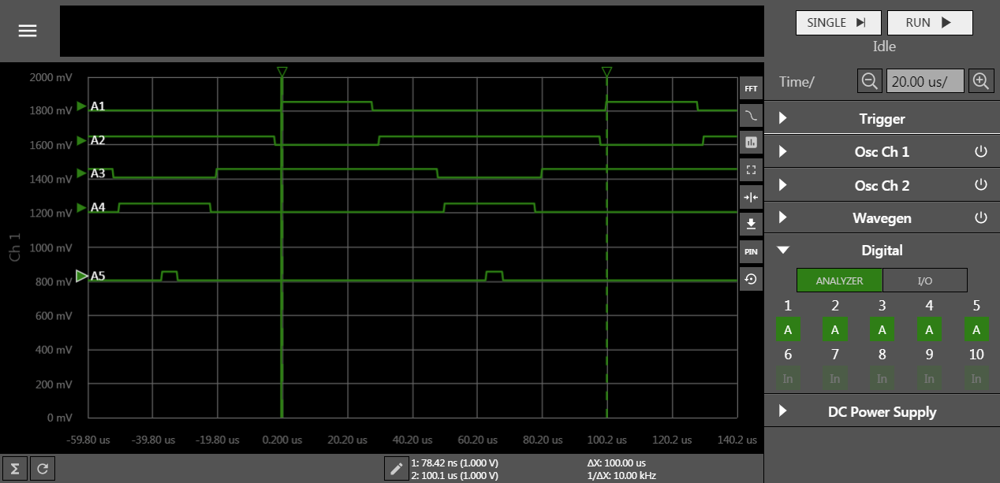

# Synchronized PWM

## 시작하는 질문

* Synchronized Swimming 은 들어 보았는데 Synchronized PWM은 뭐지?  무엇이 동기화(Synchnoized) 되었다는 말이지? 어짜피 PWM 신호라는 것이 밖으로 보이는 것도 아닌데 동기화 시켜서 예쁘게 보여야 할 이유가 있을까?

PWM이라는 것에 대해서 개략적인 내용은 이해했습니다.  Pulse Width (도통시간:  on-time)에 필요한 정보를 넣는 방법이지요.  Synchronized 라는 것은 무엇일까요? 왜 필요할까요?  DC 모터의 양방향 구동을 위해서는 H-bridge 라 불리는 전력소자 4개가 붙어있는 회로가 필요합니다.  이 4개의 전력소자를 적절히 켜고 끄고 함으로써, 즉 PWM 신호를 인가 함으로써, 전압를 자유자재로 조정할 수 있고 양방향 구동도 가능해 집니다.  단 이 PWM 신호들이 서로 독립적이지 않고 의존적으로 사용되어져야 합니다.   PWM 신호들 한 주기 내에서 조화롭게 만들어 져야만 H-bridge 가 성능을 낼 수 있습니다.  AURIX는 이를 위해서 Synchronized  PWM 출력기능을 가지고 있습니다.  이 예에서는 DC 모터를 위한 H-bridge의 경우에 대해서 설명하고 있습니다만, 이 내용이 확장되어 3상 모터, 즉 BLDCM(Blush-Less DC Motor)와 PMSM(Permanent Magnet Synchronous Motor)를 위한 인버터 구동신호에 활용될 수 있습니다. 


------


## Objectives

* ​


## References

* TC23x TC22x Family User's Manual v1.1 - Chap 24. GTM
* iLLD_TC23A Help / Modules/ 

**[Example Code]**

* MyIlldModule_TC23A -
* InfineonRacer_TC23A - 


------


## Example Description

* ​


## Background 정보

* DC 모터 제어를 위한 H-bridge (Reference: http://www.ntrexgo.com/archives/23816)
  * DC 모터 토크는 전류에 비례하고 모터에 인가는 전압을 제어함으로써 전류량을 조절할 수 있습니다.
  * 일반적으로 DC 모터 구동을 위해 4개의 스위칭 소자 (MOSFET 또는 BJT)로 구성된 H-bridge 회로를 사용합니다.
  * 스위칭 소자는 ON/OFF 스위칭을 통해 모터에 공급되는 전력 출력을 조절하게 됩니다.

​    

* H-bridge 제어 방법

  * 유니폴라 (Unipolar) 방법: 모터를 정회전 하고자 할 때 $A$에 PWM을 인가하고 $\bar{B}$는 ON으로 유지하는 방식입니다. $B$와 $\bar{A}$는 이때 OFF 상태입니다. 역회전 하고자 할 때는 $B$에 PWM을 인가하고 $\bar{A}$는 ON으로 유지하는 방식입니다. $A$와 $\bar{B}$는 이때 OFF 상태입니다. 만약, 정회전 시 $A$에 인가되는 PWM의 DUTY Ratio가 50%라면 모터 최고 속도의 50%로 정회전 하게 됩니다.

  


  * 바이폴라 (Bipolar) 방법: 모터를 정회전 하고자 할 때 $A$에 ON, $B$는 OFF 상태를 만들고, 다음에 $B$를 ON, $A$는 OFF 상태를 만듭니다. 즉, $B$가 $A$의 역상으로 동작하도록 합니다. $A$에 인가되는 DUTY Ratio가 50%일 때 모터가 정지합니다. $A$에 인가되는 DUTY Ratio가 75%일 때 최고 속도의 50%로 정회전 하게 됩니다.  이 방식은 저속에서 속도 제어 특성을 좋게 하지만 모터의 인덕턴스가 낮은 겨우 대기 전류가 높아 전력 낭비를 야기하며 모터 발열을 일으킬 수 있습니다.  

## AURIX - related

* ​


## iLLD - related

* ​


### Module Configuration

```c

```


### Interrupt Configuration

```c

```


### Module Behavior

```c

```





## 추가적인 설명

> * GtmTomPwmHl 은 원래는 4개의 스위치에 대한 개별적인 Pwm 을 조정하는 것
> * InfineonRacer 에서는 Top 소자와 Bottom 소자가 한 PWM 신호에 묶여서 상보적으로 동작하므로
>   * 좌측과 우측 신호 두개만 필요
>   * dead-time은 0으로 바꿔 주고.


------


## 마치며...

학생 때 전자회로에서 트랜지스터를 배우면서 Class A, B, C 등 동작점의 위치에 따라 분류하고 특성을 이해하고 열심히 공부했습니다.  그러나 마이크로컨트롤러를 활용하여 프로그래밍을 하는 일을 주로 하면서 위와 같은 증폭 방식은 한번도 사용해 본 적이 없습니다.  이 방법은 고급 아날로그 오디오 앰프를 만드는 경우와 같이 아날로그 방식으로 신호를 증폭하는 용도로 주로 사용되는 방식입니다. 실제 마이크로컨트롤러를 사용한 회로에서는 PWM을 증폭 방법으로 주로 사용하기 때문입니다.  

전력반도체의 가격 하락과 마이크로컨트롤로의 보편화로 이전에는 고급(?) 기술이었던 모터 구동 기술이 이제는 일반적인 기술로 인식되어 가고 있습니다.  대학원에서 1~2년 동안 열심히 배워야 할 수 있었던 동기모터의 벡터제어가 이제는 키트 형식으로 구성된 하드웨어와 잘 갖춰진 라이브러리 함수들을 사용하는 프로그래밍 예제로 바뀌게 되었습니다.  이렇게 고급 방식으로 DC, BLDCM, PMSM 모터를 구동할 때 꼭 필요한 것이 바로 동기화된 PWM 출력 모듈입니다.  단상으로 DC 모터를 구동할 때 사용하였던 H-Bridge 에 2개의 스위칭 소자를 추가하면 3상 구동용 인버터를 만들 수 있습니다.  PWM 출력 신호도 2채널 추가하기만 하면 필요한 구성은 끝나게 됩니다.  물론 각 스위치의 도통시간을 결정하는 방법과 3상 모터에 필요한 여러가지 변환 이론은 추가적으로 필요합니다.  위의 예제를 이해하셨다면 AURIX를 사용하여 3상 인버터용 소프트웨어를 만들 수 있는 기초적인 내용은 이해가 된 것입니다.   


