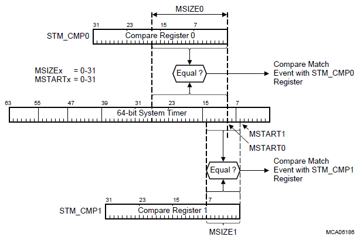

Twinkle twinkle little star
===========================

## 시작하는 이야기

"반짝 반짝 작은별~~~" 우리가 즐겨 부르던 동요 입니다.  

마이크로컨트롤러에 프로그래밍 할 때도 첫번째로 만들어 봐야 하는 프로그램 입니다.  단 불빛만 반짝인다고 만족해서는 안됩니다.  이 프로그램으로 우리는 다음의 사항들을 확실하게 할 수 있게 됩니다.

* 디지탈출력을 내보낼 수 있고,
* 시스템타이머를 사용할 줄 알게 되고,
* 인터럽트를 처리할 수 있게 된다.

이 프로그램은 다른 모든 프로그램의 기초가 됩니다.  그리고 실제로 최종 프로그램을 동작 시킬 때도, background로 이 루틴을 실행해서 살았는지 죽었는지 알 수 없는 마이크로컨트롤러의 심장박동으로 사용하게 됩니다.  깜깜하기만 한 마이크로컨트롤러 보드에 작은 불빛을 밝혀 봅시다.


Objectives
----------

-	시스템타이머를 이해하고 활용할 수 있게 한다.
		인터럽트를 활용할 수 있게 한다.

References
----------

-	TC23x TC22x Family User's Manual v1.1 - 17 System Timer (STM)
		iLLD_TC23A 1.0.1.4.0 도움말 - STM
		iLLD_TC23A_Demos_1_0_1_4_0 - StmDemo

**[Example Code]**

* MyStm_TC23A 

- MyIlldModule_TC23A - Stm

  ​

Example Description
-------------------

- 시스템타이머를 사용해서 1초 마다 인터럽트를 발생시킨다.
- 인터럽트를 사용해서 2초 주기로 LED107를 점멸한다.


## Backgound 정보

다음의 내용은 설명하고 싶으면 ^^

* 타이머 활용하는 방법 일반론 

* 일반 타이머와 시스템 타이머의 차이

  ​

AURIX - related
--------------

> Datasheet 에 있는 그림과 설명을 참고해서 하드웨어의 구조와 동작의 특징에 대해서 설명해 주세요.
>
> 모든 기능을 설명하려 하지 마시고
>
> 아래의 코드와 직접적인 연관이 있는 부분 중심으로 
>
> 그림을 넣을 때는 번호를 붙이지 마세요.  나중에 위치 바뀌면 다 틀어집니다.  번호를 붙이는 것은 도구를 사용해야지 수작업으로 하면 날 샙니다.
>
> 아래 그림 두개로 기본 동작과 특징을 모두 설명할 수 있을 것 같네요.





iLLD - related
--------------


> 이 파트에서는 iLLD Demo의 모듈 초기화 함수 _init(void) 와 주기 실행 함수 -run(void) 소스 코드를 중심으로 설명하는 것이 어떨까?
>
> 추가로 인터럽트 설정과 동작 관련 설명 필요하면
>
> 더 설명하려 들면 끝도 한도 없어서 
>
> 위의 Example 설명에서 정리한 내용이 이 모듈 설정과 실행의 기능 요구 사항이라 볼 수 있고.
>
> 이 기능 요구 사항이 iLLD로 어떻게 구현되는지 보여주는 방식이겠지요.

### Module Configuration 

```c
void IfxStmDemo_init(void)
{
	// ...
    initTime();

    g_Stm.stmSfr = &MODULE_STM0;
    IfxStm_initCompareConfig(&g_Stm.stmConfig);

    g_Stm.stmConfig.triggerPriority = ISR_PRIORITY_STM_INT0;
    g_Stm.stmConfig.typeOfService   = IfxSrc_Tos_cpu0;
    g_Stm.stmConfig.ticks           = TimeConst_1s;

	IfxStm_initCompare(g_Stm.stmSfr, &g_Stm.stmConfig);
	// ...
}

```

> 관련 API 와 설정에 관계된 정보들에 대해서 추가적인 기술을 해 주세요.
>
> 하드웨어와 연관지어 설명할 필요가 있으시면 하시고
>
> 이하 부분 마찮가지로...


### Interrupt Configuration 

```c
// in ConfigurationIsr.h
#define ISR_PRIORITY_STM_INT0       40
#define ISR_PROVIDER_STM_INT0       IfxSrc_Tos_cpu0    
#define INTERRUPT_STM_INT0          ISR_ASSIGN(ISR_PRIORITY_STM_INT0, ISR_PROVIDER_STM_INT0) 

// in StmDemo.c
IFX_INTERRUPT(STM_Int0Handler, 0, ISR_PRIORITY_STM_INT0);
```


### Stm 동작

```c
void STM_Int0Handler(void)
{
    IfxStm_clearCompareFlag(g_Stm.stmSfr, g_Stm.stmConfig.comparator);
	IfxStm_increaseCompare(g_Stm.stmSfr, g_Stm.stmConfig.comparator, TimeConst_1s);
    IfxCpu_enableInterrupts();
    IfxBlinkLed_Task();
}

void IfxStmDemo_run(void)
{
    while (g_Stm.counter < 10)
    {}
}
```


### BSP Timer 관련

> 이 예제의 경우에는 특별하게 모듈과 직접적이지 않은,
>
> initTime() 과 TimeConst_1s 등이 있어서 
>
> 제반 지식을 넓히는 의미에서 관련 내용을 설명하는 것도 좋을 듯


## 추가적인 설명

> 만약 센서를 사용하는 것이면 관련된 좀 더 상세한 정보
>
> 프로그래밍을 설명하는 것에서 모듈과 직접적인 연관성이 없는 정보
>
> InfineonRacer로 변환하는 과정에서 설계 및 코드를 변경해야 하는 정보 등등을 추가적으로 필요할 때 기술
>
> 
>
> 이 챕터의 경우에는 Stm 자체로 InfineonRacer 에서 사용되지는 않고 스케쥴러 안에 묶여 들어가니까  InfineonRacer 와 관련된 것은 더 정리할 것은 없어 보입니다.  대신 Exercise 를 두개 추가하고 그 의미들을 생각해 보도록 유도하는 것은 어떨까요?


### [Exercise 1] 바ㅡㅡ안 짜ㅡㅡ악 을 빤짝빤짝 으로 

* 위의 예제는 인터럽트의 주기가 1초여서 LED107의 점멸 주기가 2초가 됩니다.
* 주기를 100msec로 바꿔서 200msec 주기로, 즉 5Hz의 주기로 점멸해 봅시다. 
* 위의 코드에서 2군데만 수정하면 됩니다.


### [Exercise 2] 인터럽트 발생 주기를 1msec로

* 인터럽트 발생 주기를 1msec 로 변경해 봅시다.
* LED107은 5Hz로 점멸시킵니다.  LED108은 0.5Hz로 점멸시킵니다.
* 프로그래밍 가이드
  * ISR에서 직접 LED를 점멸하지 않습니다.  대신 `g_Stm.counter`를 1씩 증가 시킵니다.
  * `IfxStmDemo_run(void)` 함수에서 `g_Stm.counter` 값을 살펴보면서 100 이 될 때마다, 그리고 1000 이 될 때마다 LED107 Toggle 함수와 LED108 Toggle 함수를 호출하도록 합니다.
* **[중요]** 
  * 위와 같은 방식으로 프로그래밍 하는 것이 스케쥴러의 기본 아이디어 입니다.  
  * 여기서 가장 기본이 되는 주기적 증가 카운터, 이 예에서는 `g_Stm.counter` 를 Tick 이라 부르며, 시계의 초침과 같은 역할을 합니다.

