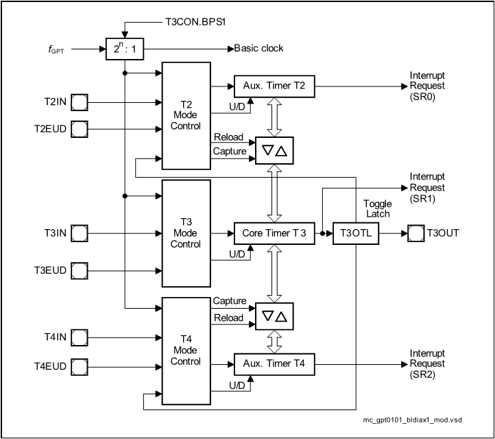
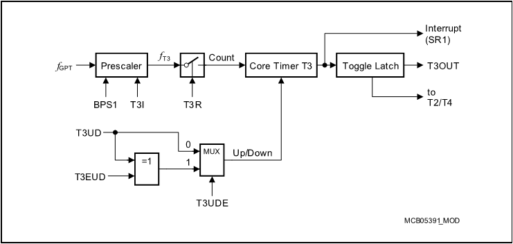
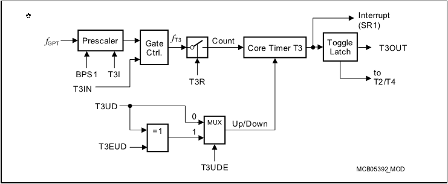
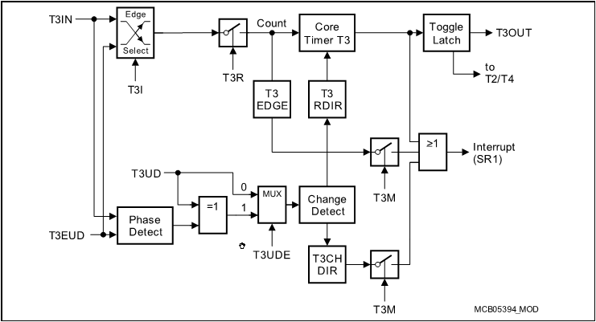
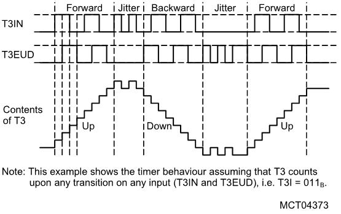
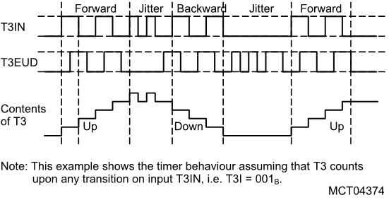

## 시작하는 질문

* 모터의 속도를 측정하려면 무슨 센서를 써야하지?  속도센서라는 것이 있나?  당연히 있겠지! 자동차의 계기판에 차속과 엔진 rpm을 보여주는 부분이 있잖아?  그 원리를 사용하면 회전하는 모터의 속도도 알아 낼 수 있고, 달리는 차량의 속도도 알아낼 수 있을거야.

움직이는 물체의 속도를 측정하는 것은 그렇게 쉬운 일은 아닙니다.  기본적으로는 위치의 변화를 측정해서 그 값을 미분해서 속도를 알아내는 방법을 사용하고 있습니다.  간단하게는 회전축에 반사형 광센서나 홀센서 등을 붙여 회전과 동기화된 펄스 신호를 만들어 내고, 그 신호의 주기를 측정해서 간접적으로 회전 속도를 얻을 수 있습니다.  

여기에 한걸음 더 나아가 회전체의 속도 뿐만 아니라 회전체의 위치, 즉 각도를 알아내야 할 경우도 있습니다.  대표적으로 자동차 엔진의 크랭크 축, 또는 동기전동기의 회전축의 위치를 알아야 제어를 할 수 있습니다.  이런 목적으로 증분형 엔코더(incremental encoder)라는 것을 사용합니다.  위의 속도 측정방법과의 차이는 훨씬 더 많은 펄스 신호를 발생하도록 한다는 것입니다.  이 때 1회전당 몇개의 펄스를 발생시키는가(PPR: Pulse Per Revolution)로 엔코더의 사양을 결정하는 중요한 정보가 있습니다.


------


## Objectives

* General Purpose Timer 이해
* Input Capture와 Pulse Accumulator를 사용한 속도 측정 방법 습득


## References

* TC23x TC22x Family User's Manual v1.1 - Chap 26 GPT12
* iLLD_TC23A Help / Modules/ GPT12

**[Example Code]**

* MyIlldModule_TC23A - GPT12
* InfineonRacer_TC23A - TestGpt12

------


## Example Description

* ​

## Background 정보

> * 속도 측정 방법
>   * Input capture:  입력된 신호에 edge가 발생했을 때 마다 time stamp를 찍고, 현재와 직전 time stamp 간의 차이를 통해 속도를 계측하는 방법입니다.
>   * Pulse accumulator: 일정한 시간동안 입력된 pulse 정보를 counting하고, pulse 갯수를 통해 속도를 계측하는 방법입니다.
> * Encoder
>   * 속도 계측을 위해 사용되는 센서로 회전축에 원판을 설치하고 원판 둘레에 얇은 slip을 내어 빛이 통과하게 만들고, 원판 앞뒤로 발광/수광 소자를 장착합니다. 원판이 설치된 축이 회전하게 되면 slip에 의해 발광소자에서 발생된 빛이 순간적으로 수광소자에 도달하게 되는 데, 이때 발생되는 신호를 출력하는 것이 Encoder의 원리가 되겠습니다. 만약 축이 빠르게 회전하게 되면 수광소자에 빛이 도달하는 횟수가 증가하게 됨으로, 짧은 시간동안 많은 수의 pulse가 나오게 되며, 반대로 저속으로 회전하면 pulse 발생 주기가 느려지게 됩니다.
>
>

## AURIX - related

* Overview
    * General Purpose Timer (GPT)는 시간 측정, 이벤트 카운팅, 펄스 폭 측정, 펄스 생성 등 다양항 목적에 맞게 사용될 수 있습니다. 총 5개의 16 bits Timer가 존재하는데 이 Timer들은 2개의 Timer 블럭으로 나뉘게 됩니다(GPT1, GPT2). 각 Timer는 다양한 모드 중 하나로 설정 후 독립적 사용이 가능하며, 같은 Timer 블럭 내에서는 하나의 Timer가 다른 Timer와 합쳐져서 구동되기도 합니다.
    * GPT1
	     * GPT1 블럭은 3개의 Timer로 구성되어 있습니다. Core timer인 T3와 두 개의 auxiliary timer T2와 T4가 있습니다. Auxiliary timer들은 설정에 따라 core timer를 위한 reload나 capture register로도 사용될 수 있습니다.
	     * 최대 해상도는 이고, 이 때 는 GPT12 블럭의 clock을 나타냅니다.
	     * 4개의 모드를 지원하며 모드 종류는 다음과 같습니다.
	         * Timer Mode
	         * Gated Timer Mode
	         * Counter Mode
	         * Incremental Interface Mode
    * Capture/Reload 기능을 제공합니다.
    * GPT2
       * GPT2 블럭은 2개의 Timer로 구성되어 있습니다. Core timer인 T6와 auxiliary timer T5가 있습니다.
        * 최대 해상도는 이입니다.
        * 3개의 모드를 지원하며 모드 종류는 다음과 같습니다.
           * Timer Mode
           * Gated Timer Mode
           * Counter Mode
           * Capture/Reload 기능을 제공합니다.

* GPT1
    * 기본적으로 모든 Timer는 count를 up 또는 down 시킵니다.
    * 각 Timer는 입력 핀을 가지고 있으며 Gated Timer Mode에서는 gate control로, Counter Mode에서는 count input으로 사용됩니다.
    * Timer를 Up 시킬 지, Down시킬 지는 사용자가 설정할 수 있습니다.
    * Core Timer의 overflow나 underflow 발생 여부는 Output Toggle Latch T3OTL을 통해 알아낼 수 있습니다.
    * GPT1과 관련된 Interrupt는 SR0, SR1, SR2를 통해 전달됩니다.

    

    ​

    * Modes
       * Timer Mode: 를 Prescaler를 통해 조정한 다음 출력 clock에 대해 count를 up 또는 down 합니다. T3R은 스위치로서 count를 내보낼 지 여부를 결정합니다.

       
       * Gated Timer Mode: 동작 방식은 Timer Mode와 동일하나, Prescaler 출력에 Gate Control이 추가된 형태 입니다. Gate Control은 외부 입력 T3IN을 받아서 clock을 내보낼 지 여부를 결정하게 됩니다. 따라서, T3IN은 반드시 설정을 해 주어야 합니다. 요컨대, T3IN과 T3R이 Enable 될 때만 count가 발생됩니다.

       

       * Counter Mode: Timer Mode에서 사용되었던 를 외부 입력 (T3IN)으로 변경한 것입니다. 그 외 다른 동작은 Timer Mode와 같습니다. T3IN의 rising과 falling edges 들 중 어떤 것을 count를 할 건지 설정이 가능합니다.

       

       * Incremental Interface Mode: T3IN과 T3EUD의 입력 순서 및 edge 변이를 따라 count를 up하거나 down 시키는 모드입니다. 두 입력의 입력 순서에 따라 방향을 감지할 수 있는 장점이 있고, 두 입력 간의 위상차를 통해 단일 입력 대비 2배 또는 4배 정도의 해상도를 얻을 수 있습니다.
           * Up 또는 down count를 위한 조건은 두 입력 중 하나의 입력에서 edge가 발생했을 때 다른 입력의 level을 확인하여 결정하게 됩니다. 이때, 발생된 edge의 종류도 고려합니다. 아래 표를 참고하시기 바랍니다.
           * 그리고 몇 개의 입력의 edge 정보를 사용할 건지에 따라 up / down의 횟수를 결정할 수 있습니다.

    

    ​

    ​								Up/Down Count 발생 조건

    


    ​						2개의 입력 edge를 모두 count에 반영하였을 경우

    

    ​

    ​						1개의 입력 edge만 count에 반영하였을 경우

    

  * GPT2

    * 기본적인 기능은 GPT1과 유사합니다.
    * 2개의 Timer (T5, T6)를 사용합니다.
    * 지원되는 모드는 Timer Mode, Gated Timer Mode, Counter Mode이며, 동작 방식은 위에 설명한 것과 같습니다.
    * Core Timer는 T6이며, Auxiliary Timer는 T5입니다.

    ​

## iLLD - related

* ​

### Module Configuration

```c
void Gpt12Demo_init(void)
{
    //    printf("Gpt12_init() called. \n");

    initTime();

    /* Initialize global clocks */
    /* FIXME Global prescaller should not be set by the driver as they are global resources */
    IfxGpt12_enableModule(&MODULE_GPT120);
    // Gpt1 block clock 설정
    IfxGpt12_setGpt1BlockPrescaler(&MODULE_GPT120, IfxGpt12_Gpt1BlockPrescaler_8);
    // Gpt2 block clock 설정
    IfxGpt12_setGpt2BlockPrescaler(&MODULE_GPT120, IfxGpt12_Gpt2BlockPrescaler_4);

    // Encoder로 들어오는 pulse를 세기 위한 Gpt configuration 생성
    IfxGpt12_IncrEnc_Config config;
    // Gpt Configuration 초기화
    IfxGpt12_IncrEnc_initConfig(&config, &MODULE_GPT120);
#if 1
    {
        /* Test implementation with T3 as core */
        config.base.offset                    = 0;
        config.base.reversed                  = FALSE;
        config.base.resolution                = 32; // 2048; for test purpose
        config.base.periodPerRotation         = 1;
        config.base.resolutionFactor          = IfxStdIf_Pos_ResolutionFactor_fourFold;
        config.base.updatePeriod              = 100e-6;
        config.base.speedModeThreshold        = 200;
        config.base.minSpeed                  = 10;
        config.base.maxSpeed                  = 500;
        config.zeroIsrPriority                = ISR_PRIORITY(INTERRUPT_INCRINC_ZERO);
        config.zeroIsrProvider                = ISR_PROVIDER(INTERRUPT_INCRINC_ZERO);
        config.pinA                           = &IfxGpt120_T3INA_P02_6_IN;
        config.pinB                           = &IfxGpt120_T3EUDA_P02_7_IN;
        config.pinZ                           = &IfxGpt120_T4INA_P02_8_IN;
        config.pinMode                        = IfxPort_InputMode_noPullDevice;

        config.base.speedFilterEnabled        = TRUE;
        config.base.speedFilerCutOffFrequency = config.base.maxSpeed / 2 * IFX_PI * 2;
    }
#else
    {
        /* Test implementation with T2 as core */
        config.base.offset                    = 100;
        config.base.reversed                  = FALSE;
        config.base.resolution                = 2048;
        config.base.periodPerRotation         = 1;
        config.base.resolutionFactor          = IfxStdIf_Pos_ResolutionFactor_fourFold;
        config.base.updatePeriod              = 100e-6;
        config.base.speedModeThreshold        = 200;
        config.base.minSpeed                  = 10;
        config.base.maxSpeed                  = 500;
        config.zeroIsrPriority                = ISR_PRIORITY(INTERRUPT_INCRINC_ZERO);
        config.zeroIsrProvider                = ISR_PROVIDER(INTERRUPT_INCRINC_ZERO);
        config.pinA                           = &IfxGpt120_T2INA_P00_7_IN;
        config.pinB                           = &IfxGpt120_T2EUDA_P00_8_IN;
        config.pinZ                           = &IfxGpt120_T4EUDA_P00_9_IN;
        config.pinMode                        = IfxPort_InputMode_noPullDevice;

        config.base.speedFilterEnabled        = TRUE;
        config.base.speedFilerCutOffFrequency = config.base.maxSpeed / 2 * IFX_PI * 10;
    }
#endif
    IFX_VALIDATE(IFX_VERBOSE_LEVEL_ERROR, IfxGpt12_IncrEnc_init(&g_Gpt12.incrEnc, &config));

    g_Gpt12.control.run                  = TRUE;
    g_Gpt12.control.direction            = IfxStdIf_Pos_Dir_forward;
    g_Gpt12.control.resolution           = config.base.resolution;
    g_Gpt12.control.step                 = 3;
    g_Gpt12.control.rawPosition          = config.base.offset;
    g_Gpt12.control.speed                = IFX_PI * 2.0;
    g_Gpt12.control.multiplicationFactor = config.base.resolutionFactor;
    g_Gpt12.control.updatePeriod         = config.base.updatePeriod;
    g_Gpt12.control.positionMask         = g_Gpt12.control.resolution * g_Gpt12.control.multiplicationFactor - 1;

    g_Gpt12.interface.A                  = config.pinA->pin;
    g_Gpt12.interface.B                  = config.pinB->pin;
    g_Gpt12.interface.Z                  = config.pinZ->pin;

    /* Overwrite port configuration to enable feature check */
    IfxPort_setPinModeOutput(g_Gpt12.interface.A.port, g_Gpt12.interface.A.pinIndex, IfxPort_OutputMode_pushPull,
        IfxPort_OutputIdx_general);
    IfxPort_setPinModeOutput(g_Gpt12.interface.B.port, g_Gpt12.interface.B.pinIndex, IfxPort_OutputMode_pushPull,
        IfxPort_OutputIdx_general);
    IfxPort_setPinModeOutput(g_Gpt12.interface.Z.port, g_Gpt12.interface.Z.pinIndex, IfxPort_OutputMode_pushPull,
        IfxPort_OutputIdx_general);
}
```


### Interrupt Configuration

```c

```


### Module Behavior

```c
// 엔코더 인터페이스 테스트를 위하여 인위적으로 pulse를 만들어준다
void Gpt12Demo_step(void)
{
    if (g_Gpt12.control.run)
    {
        sint32 rawPosition;
        rawPosition = g_Gpt12.control.rawPosition;

        if (g_Gpt12.control.direction == IfxStdIf_Pos_Dir_forward)
        {
            g_Gpt12.control.step++;
            g_Gpt12.control.step &= 0x3;
            rawPosition++;
        }
        else
        {
            g_Gpt12.control.step--;
            g_Gpt12.control.step &= 0x3;
            rawPosition--;
        }

        rawPosition                &= g_Gpt12.control.positionMask;
        g_Gpt12.control.rawPosition = rawPosition;

#if 1
		// Encoder 중에서도 Z상이 있는 게 있고 없는 게 있으므로 선택적으로 Z상을 만든다.
        if (g_Gpt12.control.direction == IfxStdIf_Pos_Dir_forward)
        {
            if (rawPosition == 0)
            {
                IfxPort_setPinHigh(g_Gpt12.interface.Z.port, g_Gpt12.interface.Z.pinIndex);
            }
            else if (rawPosition == 1)
            {
                IfxPort_setPinLow(g_Gpt12.interface.Z.port, g_Gpt12.interface.Z.pinIndex);
            }
        }
        else
        {
            if (rawPosition == g_Gpt12.control.positionMask)
            {
                IfxPort_setPinHigh(g_Gpt12.interface.Z.port, g_Gpt12.interface.Z.pinIndex);
            }
            else if (rawPosition == g_Gpt12.control.positionMask - 1)
            {
                IfxPort_setPinLow(g_Gpt12.interface.Z.port, g_Gpt12.interface.Z.pinIndex);
            }
        }

#endif
		// 4분할로 쪼개서 A상 B상의 Pulse를 만들어냄
        switch (g_Gpt12.control.step)
        {
        case 0:
            IfxPort_setPinLow(g_Gpt12.interface.A.port, g_Gpt12.interface.A.pinIndex);
            IfxPort_setPinLow(g_Gpt12.interface.B.port, g_Gpt12.interface.B.pinIndex);
            break;
        case 1:
            IfxPort_setPinLow(g_Gpt12.interface.A.port, g_Gpt12.interface.A.pinIndex);
            IfxPort_setPinHigh(g_Gpt12.interface.B.port, g_Gpt12.interface.B.pinIndex);
            break;
        case 2:
            IfxPort_setPinHigh(g_Gpt12.interface.A.port, g_Gpt12.interface.A.pinIndex);
            IfxPort_setPinHigh(g_Gpt12.interface.B.port, g_Gpt12.interface.B.pinIndex);
            break;
        case 3:
            IfxPort_setPinHigh(g_Gpt12.interface.A.port, g_Gpt12.interface.A.pinIndex);
            IfxPort_setPinLow(g_Gpt12.interface.B.port, g_Gpt12.interface.B.pinIndex);
            break;
        }
    }
}


void Gpt12Demo_run(void)
{
    printf("Gpt12_run() called \n");
    Ifx_TickTime tickPeriod;
    Ifx_TickTime tickRefresh;

    Ifx_TickTime refreshDeadLine;
    Ifx_TickTime tickDeadLine;

    tickRefresh     = g_Gpt12.control.updatePeriod * TimeConst_1s;

    refreshDeadLine = now();
    tickDeadLine    = refreshDeadLine;

    while (1)
    {
        g_Gpt12.control.run = g_Gpt12.control.speed != 0.0;

        if (!g_Gpt12.control.run)
        {}
        else
        {
            float32 roundDuration_s = (2.0 * IFX_PI) / g_Gpt12.control.speed;
            float32 tickDuration_s  = roundDuration_s / (g_Gpt12.control.positionMask + 1);

            tickPeriod = tickDuration_s * TimeConst_1s;

            if (isDeadLine(tickDeadLine))
            {
                tickDeadLine = addTTime(tickDeadLine, tickPeriod);
                Gpt12Demo_step();
            }
        }

        if (isDeadLine(refreshDeadLine))
        {
            refreshDeadLine = addTTime(refreshDeadLine, tickRefresh);
            // Gpt12 사용하여 엔코더 신호 인터페이스 확인
            IfxGpt12_IncrEnc_update(&g_Gpt12.incrEnc);

            g_Gpt12.status.speed       = IfxGpt12_IncrEnc_getSpeed(&g_Gpt12.incrEnc);
            g_Gpt12.status.rawPosition = IfxGpt12_IncrEnc_getRawPosition(&g_Gpt12.incrEnc);
            g_Gpt12.status.direction   = IfxGpt12_IncrEnc_getDirection(&g_Gpt12.incrEnc);
        }
    }
}

```


## 추가적인 설명


> 엔코더 인터페이스를 테스트 하려면 엔코더 신호가 필요
>
> encoder emulation 기능을 사용해서 엔코더 신호를 발생 시키고
>
> Gpt12 를 사용해서 엔코더 신호 인터페이스 기능 확인
>
> ```
> #define ENCODER_EMUL // 65 행 Configuration.h 파일 in InfineonRacer 프로젝트에서
> ```
>
> 을 정의 하면 emulation 할 수 있다.


------


## 마치며...

회전하는 축의 위치와 속도를 측정하는 방법은 기본적으로 모터와 엔진 등을 사용하는 제어 시스템에서 꼭 필요한 기본적인 정보 입니다.  이 값을 측정할 수 없다면 대안적으로는 관측기 등을 만들어서 사용할 수는 있습니다.  그러나 대부분, 관측기를 아무리 잘 만든다고 하더라도 시스템의 전체 동작기간 동안 활용하기는 어렵습니다.  측정할 수 있다면 가능한 정밀하게 이 정보를 알아내는 것이 시스템을 안정적으로 구성하는 첫 걸음이 됩니다.

회전축의 위치, 혹은 속도를 알아내는 기본적인 방법은 직관적으로 명확합니다.  엔코더와 같이 회전체의 특정 위치마다 펄스를 발생하는 센서를 사용하는 경우, 샘플링 주기 이내에 펄스 신호가 발생되는 변화가 있어야 측정이 가능합니다.  그러므로 시스템에서 필요로 하는 PPR을 갖는 엔코더를 선택하는 것이 중요합니다.  

위치정보로 속도를 얻는 것도 고려해야 할 사항이 많습니다.  가장 간단하게는 위치정보를 미분해서 속도를 얻을 수 있지만 이 경우 노이즈가 증폭되어 부정확한 속도를 만들어 내게 됩니다.  이를 방지하기 위해서 필터를 사용하는 등 여러가지 신호처리 기법들이 사용됩니다.  최근 angle tracking observer 라 불리는 필터를 사용해서 위치정보를 필터링하고 속도정보를 얻는 기법이 일반적으로 많이 사용됩니다.


