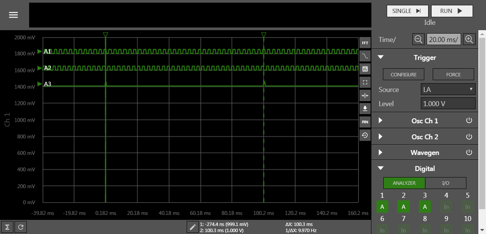

## 시작하는 질문

* 모터의 속도를 측정하려면 무슨 센서를 써야하지?  속도센서라는 것이 있나?  당연히 있겠지! 자동차의 계기판에 차속과 엔진 rpm을 보여주는 부분이 있잖아?  그 원리를 사용하면 회전하는 모터의 속도도 알아 낼 수 있고, 달리는 차량의 속도도 알아낼 수 있을거야.

움직이는 물체의 속도를 측정하는 것은 그렇게 쉬운 일은 아닙니다.  기본적으로는 위치의 변화를 측정해서 그 값을 미분해서 속도를 알아내는 방법을 사용하고 있습니다.  간단하게는 회전축에 반사형 광센서나 홀센서 등을 붙여 회전과 동기화된 펄스 신호를 만들어 내고, 그 신호의 주기를 측정해서 간접적으로 회전 속도를 얻을 수 있습니다.  

여기에 한걸음 더 나아가 회전체의 속도 뿐만 아니라 회전체의 위치, 즉 각도를 알아내야 할 경우도 있습니다.  대표적으로 자동차 엔진의 크랭크 축, 또는 동기전동기의 회전축의 위치를 알아야 제어를 할 수 있습니다.  이런 목적으로 증분형 엔코더(incremental encoder)라는 것을 사용합니다.  위의 속도 측정방법과의 차이는 훨씬 더 많은 펄스 신호를 발생하도록 한다는 것입니다.  이 때 1회전당 몇개의 펄스를 발생시키는가(PPR: Pulse Per Revolution)로 엔코더의 사양을 결정하는 중요한 정보가 있습니다.


------


## Objectives

* ​

## References

* TC23x TC22x Family User's Manual v1.1 - Chap 26 GPT12
* iLLD_TC23A Help / Modules/ GPT12

**[Example Code]**

* MyIlldModule_TC23A - GPT12
* InfineonRacer_TC23A - TestGpt12


------


## Example Description

* ​

## Background 정보

> * 참고로 input capture 에 대한 일반론 설명은 
> * 속도 측정 방법 
>   * input capture 방법
>   * pulse accumulator 방법
> * Encoder 
>
> 

## AURIX - related

* ​

## iLLD - related

* ​

### Module Configuration

```c

```


### Interrupt Configuration

```c

```


### Module Behavior

```c

```


## 추가적인 설명


> 엔코더 인터페이스를 테스트 하려면 엔코더 신호가 필요
>
> encoder emulation 기능을 사용해서 엔코더 신호를 발생 시키고
>
>  Gpt12 를 사용해서 엔코더 신호 인터페이스 기능 확인
>
> #define ENCODER_EMUL // 65 행 Configuration.h 파일 in InfineonRacer 프로젝트에서
>
> 을 정의 하면 emulation 할 수 있다. 
>
> 


------


## 마치며...

회전하는 축의 위치와 속도를 측정하는 방법은 기본적으로 모터와 엔진 등을 사용하는 제어 시스템에서 꼭 필요한 기본적인 정보 입니다.  이 값을 측정할 수 없다면 대안적으로는 관측기 등을 만들어서 사용할 수는 있습니다.  그러나 대부분, 관측기를 아무리 잘 만든다고 하더라도 시스템의 전체 동작기간 동안 활용하기는 어렵습니다.  측정할 수 있다면 가능한 정밀하게 이 정보를 알아내는 것이 시스템을 안정적으로 구성하는 첫 걸음이 됩니다.

회전축의 위치, 혹은 속도를 알아내는 기본적인 방법은 직관적으로 명확합니다.  엔코더와 같이 회전체의 특정 위치마다 펄스를 발생하는 센서를 사용하는 경우, 샘플링 주기 이내에 펄스 신호가 발생되는 변화가 있어야 측정이 가능합니다.  그러므로 시스템에서 필요로 하는 PPR을 갖는 엔코더를 선택하는 것이 중요합니다.  

위치정보로 속도를 얻는 것도 고려해야 할 사항이 많습니다.  가장 간단하게는 위치정보를 미분해서 속도를 얻을 수 있지만 이 경우 노이즈가 증폭되어 부정확한 속도를 만들어 내게 됩니다.  이를 방지하기 위해서 필터를 사용하는 등 여러가지 신호처리 기법들이 사용됩니다.  최근 angle tracking observer 라 불리는 필터를 사용해서 위치정보를 필터링하고 속도정보를 얻는 기법이 일반적으로 많이 사용됩니다. 




